# Revisão da Fase 1

**Projeto:** Sistema de alocação de motoristas Amazon DSP  
**Ambiente revisado:** [produção](https://amazon-dsp-allocation-illt.vercel.app)  
**Data:** 14/08/2026

Este documento mostra o que existe hoje na aplicação e o que ainda não foi construído. As imagens são capturas reais da aplicação em português do Brasil. Os dados de nomes e e-mails usados nas telas administrativas são dados de teste e foram removidos depois da captura.

## Telas revisadas

### `/` — Página inicial

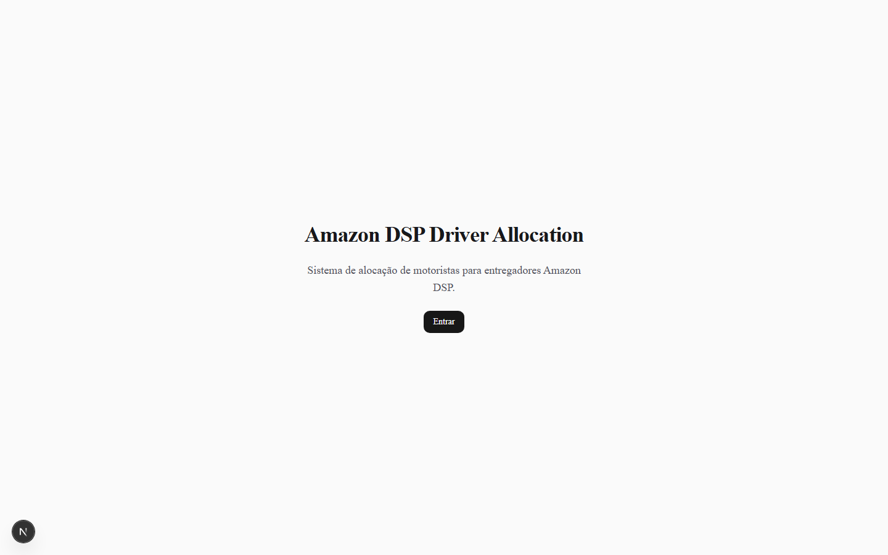

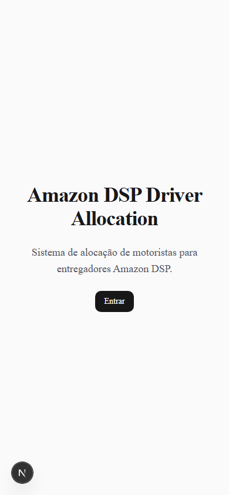

**Para que serve:** é a porta de entrada pública do sistema. Apresenta o nome do produto e leva ao login.  
**Quem pode ver:** qualquer pessoa que acesse o endereço, esteja ou não autorizada.  
**O que pode ser feito:** clicar em **Entrar** para ir à autenticação. Usuários já autenticados são encaminhados ao dashboard.

### `/login` — Login

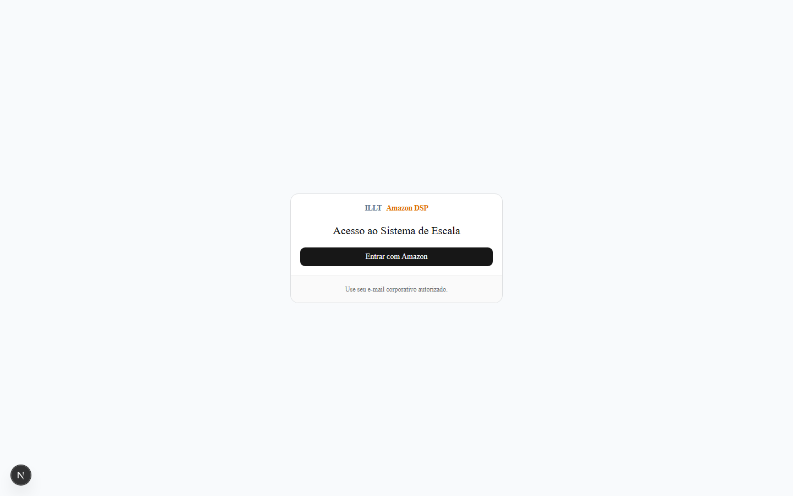

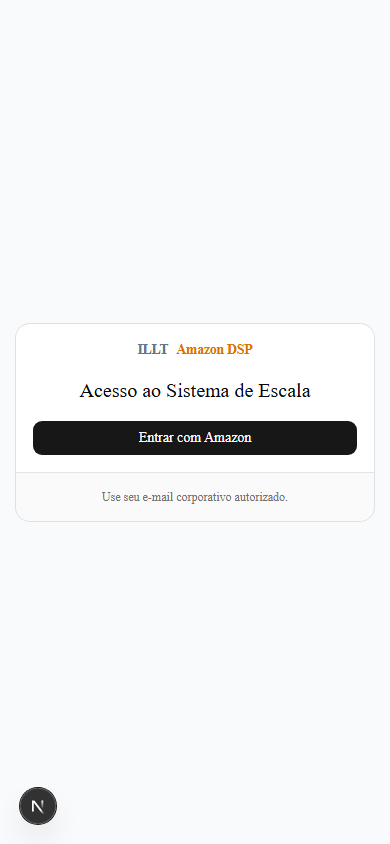

**Para que serve:** iniciar o acesso usando a conta Amazon.  
**Quem pode ver:** qualquer pessoa; somente e-mails previamente cadastrados na lista de acesso conseguem concluir a entrada.  
**O que pode ser feito:** clicar em **Entrar com Amazon**. O sistema verifica a identidade Amazon, a lista fechada de e-mails e o status da conta. Não existe aprovação automática apenas por pertencer a um domínio corporativo.

### `/onboarding` — Primeiro cadastro do motorista

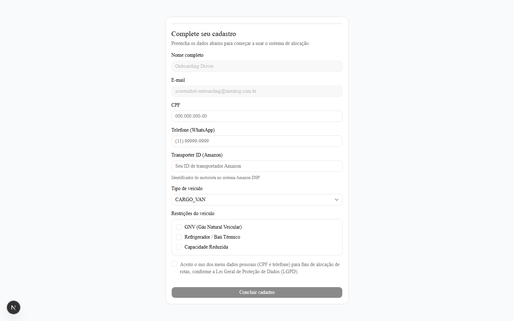

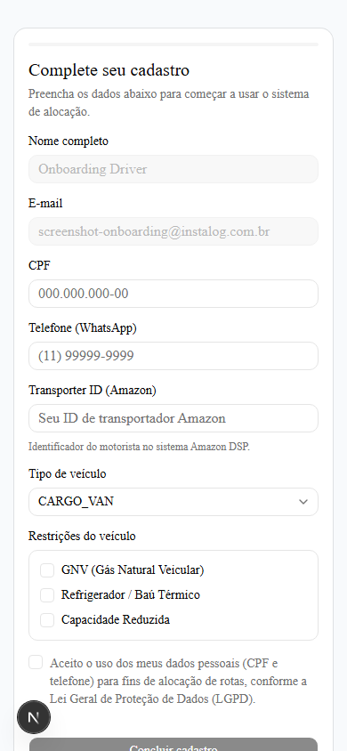

**Para que serve:** coletar os dados obrigatórios do motorista no primeiro acesso.  
**Quem pode ver:** motorista autorizado que ainda não concluiu o perfil. Supervisores, gerentes de contas e administradores não passam por este formulário como motoristas.  
**O que pode ser feito:** preencher nome, CPF, telefone/WhatsApp, Transporter ID, tipo de veículo, restrições do veículo e consentimento LGPD. A restrição **GNV (Gás Natural Veicular)** aparece uma única vez e usa o código canônico `GNV`. O motorista não pode alterar a marcação de GNV de outros motoristas.

### `/dashboard` — Dashboard

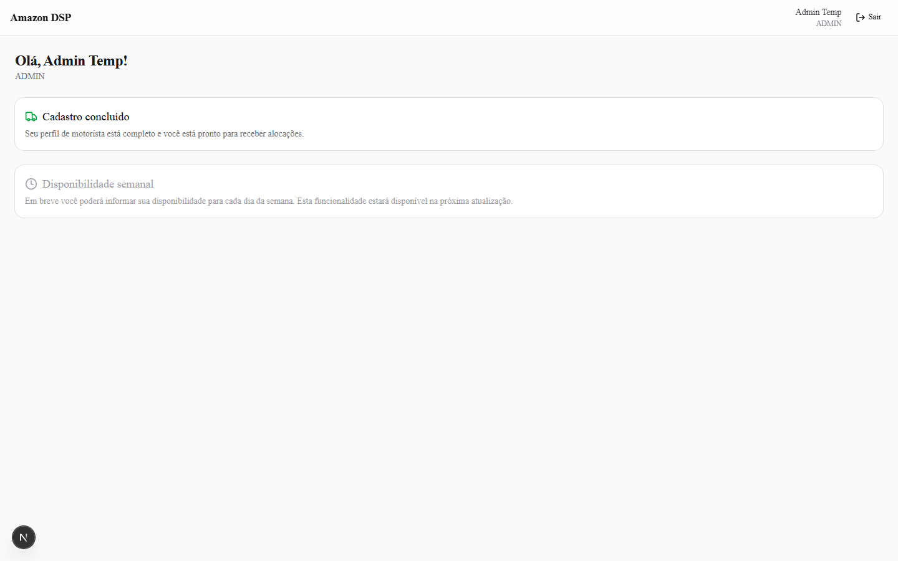

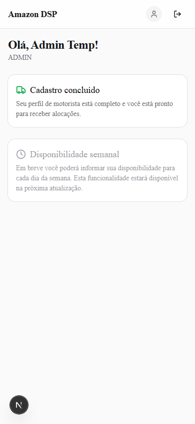

**Para que serve:** é a tela inicial depois do login. Confirma que o cadastro está concluído e indica o estado atual das funcionalidades.  
**Quem pode ver:** qualquer usuário autenticado e ativo: motorista, supervisor, gerente de contas e administrador.  
**O que pode ser feito:** consultar a confirmação do cadastro e sair da conta. A coleta de disponibilidade aparece como item desabilitado, porque ainda não existe.

### `/admin/users` — Usuários e Perfis

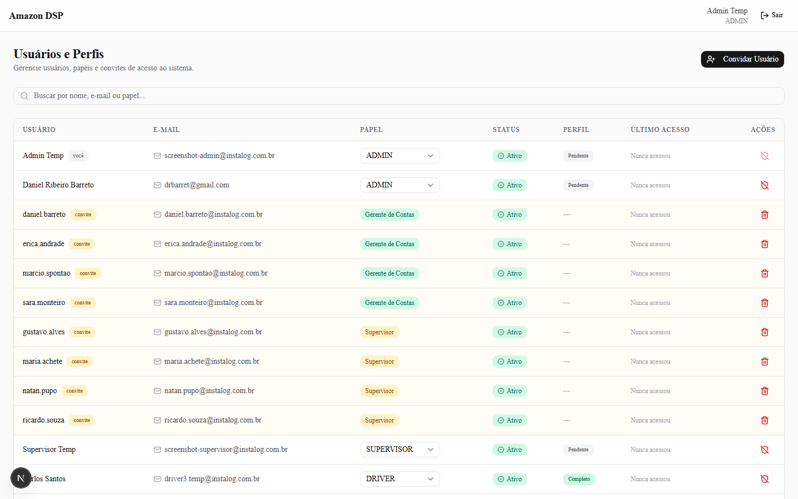

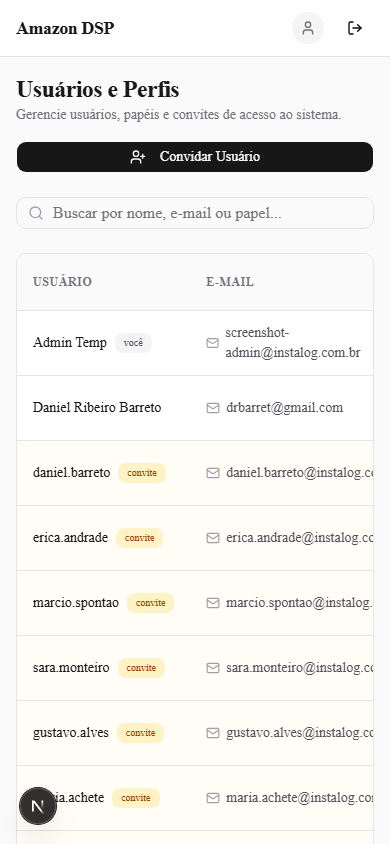

**Para que serve:** administrar usuários já criados e convites da lista fechada.  
**Quem pode ver:** administrador e gerente de contas. Supervisor e motorista recebem acesso negado.  
**O que pode ser feito:** pesquisar usuários, convidar um e-mail por vez, visualizar papel e status, alterar papéis quando permitido e revogar convites/acessos conforme a permissão. A tela junta usuários que já entraram com convites que ainda não foram usados.

### `/drivers` — Motoristas

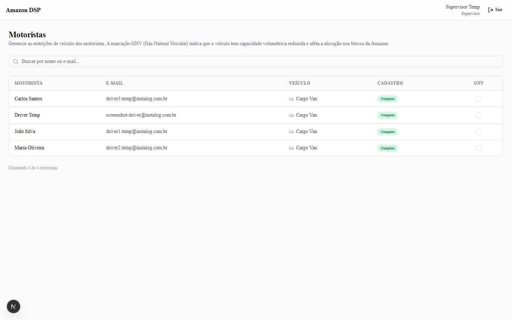

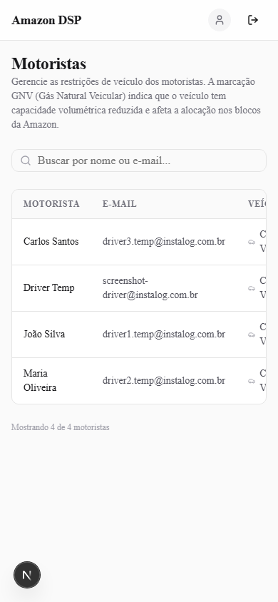

**Para que serve:** consultar os motoristas ativos e suas informações operacionais básicas.  
**Quem pode ver:** supervisor, gerente de contas e administrador.  
**O que pode ser feito:** pesquisar por nome ou e-mail, ver tipo de veículo e situação do cadastro e marcar ou desmarcar GNV. A alteração de GNV é protegida no servidor e gera registro de auditoria; motorista não consegue fazê-la.

### `/forbidden` — Acesso negado

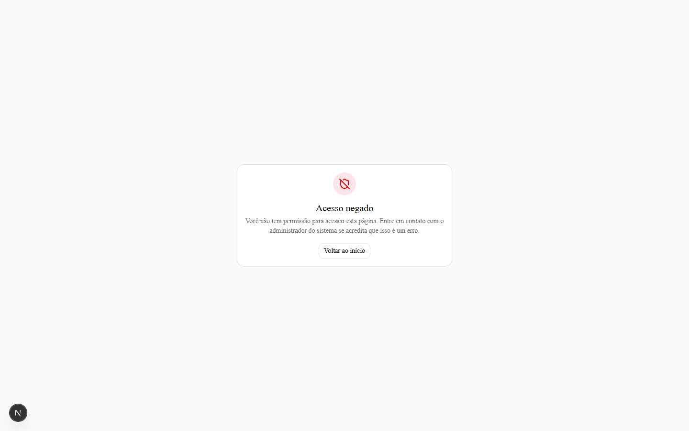

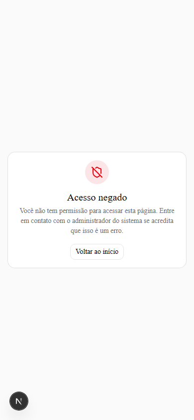

**Para que serve:** informar que o usuário está autenticado, mas não tem papel suficiente para a página solicitada.  
**Quem pode ver:** qualquer usuário autenticado que tente abrir uma área acima do seu papel.  
**O que pode ser feito:** voltar ao início. A tela não libera nenhuma permissão.

### `/auth-error` — Acesso não autorizado

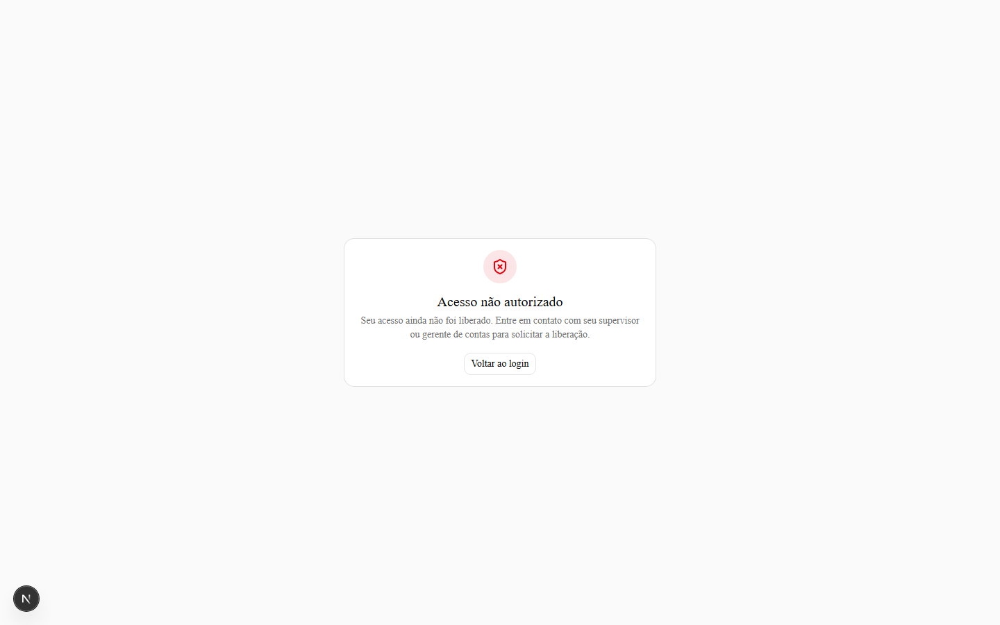

**Para que serve:** informar que o login Amazon foi concluído, mas o e-mail ainda não foi liberado na lista fechada.  
**Quem pode ver:** pessoa que tentou entrar sem uma linha ativa correspondente em `AllowedEmail`.  
**O que pode ser feito:** voltar ao login e solicitar a liberação ao supervisor ou gerente de contas. A mensagem é genérica e não revela se um e-mail existe ou não no cadastro.

## O que já funciona

- O acesso é feito pela conta Amazon, sem cadastro livre pelo motorista.
- A lista de acesso é fechada: o e-mail precisa estar pré-cadastrado e ativo.
- Contas desativadas e convites revogados não entram e não ganham papel elevado.
- Existem papéis de administrador, gerente de contas, supervisor e motorista, com bloqueios por nível.
- O motorista consegue concluir o cadastro inicial com CPF, telefone, veículo e consentimento LGPD.
- GNV está disponível no onboarding e pode ser marcado ou desmarcado por supervisor ou por papel superior. O código usado para novas gravações é `GNV`.
- Supervisores conseguem consultar motoristas ativos e administrar a marcação de GNV.
- Administrador e gerente de contas conseguem administrar usuários e convites individuais.
- CPF e telefone são protegidos antes de serem persistidos; o CPF também possui índice cego para validação de duplicidade.
- Alterações de GNV geram auditoria com autor, motorista afetado e estado anterior/novo.
- As telas públicas, de login, onboarding, dashboard, usuários, motoristas e estados de erro estão implementadas para desktop e celular.

## O que ainda NÃO existe

Ainda não existe a operação completa de escala. Especificamente, faltam:

- coleta de disponibilidade semanal;
- algoritmo de distribuição;
- publicação de escala;
- notificações WhatsApp;
- importação de scorecard;
- penalidades de comportamento;
- troca de dias;
- o menu lateral previsto em `docs/plans/ux-flows.md`, seção 4.2;
- convite em lote. Hoje é um e-mail por vez, o que vai pesar para cadastrar a frota real, já que motorista não pode se autocadastrar.

Também não existem as telas operacionais de publicação de vagas, grade de distribuição editável, escala final e envio de escala descritas no documento de UX. O dashboard atual deixa explícito que a disponibilidade está “em breve”; não se deve tratá-lo como uma escala funcionando.

## Decisões que você tomou e como ficaram

- **GNV fica:** a restrição continua no cadastro e na gestão de motoristas. O supervisor pode marcar e desmarcar. O código canônico para gravação é `GNV`; o código antigo `NATURAL_GAS` só é aceito em leituras de compatibilidade.
- **Acesso fechado à lista pré-cadastrada:** pertencer a um domínio corporativo não libera acesso automaticamente. Cada e-mail precisa estar na lista e com status ativo.
- **Login pela conta Amazon:** a autenticação continua sendo Login with Amazon; a aplicação não cria senha própria.
- **Motorista não se autocadastra:** o motorista só entra depois que seu e-mail for pré-cadastrado por alguém autorizado. Depois do primeiro login, ele completa o próprio perfil.

## Riscos e limitações conhecidas

- A revogação de acesso ou de papel vale em até **15 segundos**, não instantaneamente. O token pode permanecer válido durante essa janela.
- Se a linha do dono em `AllowedEmail` for apagada ou revogada, o dono fica trancado fora. A recuperação exige acesso direto ao banco; não existe porta dos fundos.
- A tela **Usuários e Perfis** foi desenhada sem wireframe, porque `ux-flows.md` só a cita na navegação. Ela atende ao controle básico atual, mas ainda não deve ser considerada um desenho final de operação.
- O cadastro de convites é individual. Para a frota real, cadastrar muitos motoristas manualmente será demorado até existir convite em lote ou importação.
- A aplicação ainda não calcula nem publica escalas. Os dados de disponibilidade, scorecard e WhatsApp previstos no fluxo ainda não estão conectados.

## Como testar você mesmo

1. Abra [https://amazon-dsp-allocation-illt.vercel.app](https://amazon-dsp-allocation-illt.vercel.app).
2. Clique em **Entrar** e depois em **Entrar com Amazon**.
3. Faça login com a sua conta Amazon. Ela precisa continuar na lista pré-cadastrada e ativa.
4. Confirme que você chega ao dashboard e que seu nome e papel aparecem no cabeçalho.
5. Abra `/admin/users` diretamente. Como administrador, você deve ver a lista de usuários e convites.
6. Pesquise um e-mail, confira o papel e o status e, se necessário, teste um convite de teste. Não use e-mail real de motorista sem confirmar antes.
7. Abra `/drivers`. Pesquise um motorista de teste e marque/desmarque GNV. Confirme que a tela atualiza a situação.
8. Saia da conta e tente abrir `/admin/users` ou `/drivers`. A aplicação deve redirecionar para o login.
9. Para testar a restrição de papel, entre com uma conta de supervisor e tente `/admin/users`; o resultado esperado é **Acesso negado**.
10. Para testar a lista fechada, tente uma conta Amazon que não esteja pré-cadastrada; o resultado esperado é **Acesso não autorizado**.
11. Não espere encontrar coleta de disponibilidade, distribuição, publicação de escala ou envio por WhatsApp nesta fase: essas partes ainda não existem.

## Conclusão

A Fase 1 entrega autenticação Amazon, controle de acesso fechado, papéis, onboarding do motorista, gestão inicial de usuários e gestão de GNV. Ela ainda não entrega o ciclo operacional de escala. O próximo trabalho deve priorizar o cadastro em lote da frota e, em seguida, a coleta de disponibilidade e o fluxo de distribuição/publicação.