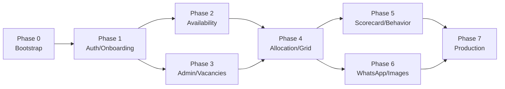

# Amazon DSP Driver Allocation System — Implementation Plan

> **Document location:** `plans/PLAN.md`  
> **Based on:** `requirements.md`, `adr.md`, `data-model.md`, `ux-flows.md`  
> **Team assumption:** 1–2 developers, part-time (≈20–30 h/week each)  
> **Last updated:** 2026-08-07

---

## 1. Project Overview and Success Criteria

### 1.1 Overview

Build a mobile-first web application that consolidates driver (DA) availability, publishes approved Amazon vacancies, distributes drivers automatically across shifts, allows supervisor edits, and delivers each driver's individual schedule via WhatsApp Business.

The system targets the ILLT Amazon DSP hub operation (initially XSP7, with ELP7 and DSP5 as follow-on regions) and must handle approximately 100 active drivers.

### 1.2 Success Criteria

| ID | Criterion | How measured |
|----|-----------|--------------|
| SC-01 | Drivers can log in with Amazon OAuth and complete onboarding in under 5 minutes. | Onboarding funnel completion rate ≥ 95 %. |
| SC-02 | Availability collection window opens/closes automatically and can be extended by 30 minutes. | Automated cron + manual extension tested. |
| SC-03 | Supervisor can publish vacancies, run allocation, and manually adjust the roster without violating business rules. | 0 published violations of the 6-day consecutive rule or vehicle mismatches. |
| SC-04 | Allocation honors availability, vehicle restrictions, favorites, penalties, and consecutive-day limits. | Unit-test coverage for allocation rules ≥ 80 %. |
| SC-05 | Final schedule is delivered to each driver via WhatsApp with delivery/read receipts. | Send success rate ≥ 98 %. |
| SC-06 | All manual schedule changes and system events are auditable. | Every `SCHEDULE_UPDATED`, `MANUAL_OVERRIDE`, and `WHATSAPP_SENT` event persisted. |
| SC-07 | System is LGPD-compliant: consent, encryption, access control, and data retention. | Privacy notice + consent log + encrypted CPF/phone. |
| SC-08 | Page load for the weekly schedule grid is under 3 seconds for 100 drivers. | Load test in staging. |

---

## 2. Recommended MVP Scope and What Can Be Deferred

### 2.1 MVP Scope (Phases 0–4)

The MVP is the smallest system that lets a supervisor collect availability, publish vacancies, run automatic allocation, edit the schedule, and send individual schedules by WhatsApp.

**In MVP:**
- Amazon Cognito OAuth login + domain gating + three roles.
- Driver onboarding (name, CPF, phone, vehicle type, restrictions, transporter ID).
- Weekly availability form (Sim / Não / Ciclo 2) with open/close window + 30-minute extension.
- Admin dashboard, driver management, and vacancy publishing.
- Rule-based allocation algorithm with manual editing and validation.
- Editable weekly schedule grid with status legend and totals.
- WhatsApp Business API integration with generated schedule image.
- Audit log for all mutations.

### 2.2 Deferred to Post-MVP

| Feature | Reason | Estimated Phase |
|---------|--------|-----------------|
| Amazon scorecard PDF parser and automatic favorite flags | Format/source unknown; can be managed manually in MVP. | Phase 5 |
| Behavior records and performance-based penalties | Business weights undefined; manual penalties can be simulated via notes in MVP. | Phase 5 |
| Advanced optimization (load balancing, multi-region, multi-objective solver) | Rule-based heuristic satisfies requirements first; optimize later. | Phase 7+ |
| Email backup notifications | Nice-to-have; WhatsApp is primary channel. | Phase 7+ |
| PWA push notifications | Adds complexity; in-app banners sufficient for MVP. | Phase 7+ |
| Multi-tenant / multi-DSP support | Single operator (ILLT) in scope. | Phase 7+ |
| BI reports and analytics export | Audit log + basic dashboard enough for launch. | Phase 7 |
| Automatic Amazon vacancy import | Manual CSV upload covers the immediate need. | Phase 5–6 |

---

## 3. Implementation Phases

### Phase 0 — Project Bootstrap

**Goal:** Establish repository, infrastructure, CI/CD, database, and initial schema.

**Deliverables:**
- GitHub repository with Next.js 14+ App Router, TypeScript strict, Tailwind, shadcn/ui, Prisma, Vitest.
- Vercel project with `development`, `staging`, and `production` environments.
- PostgreSQL database per environment (Supabase recommended; AWS RDS fallback).
- Redis per environment (Upstash recommended; ElastiCache fallback).
- GitHub Actions pipeline: lint, format, typecheck, unit tests, deploy to staging on merge.
- Prisma initial migration based on `data-model.md`.
- Environment variable template and secret management plan.
- `README.md` with local setup and deployment instructions.

**Estimated duration:** 2–3 weeks (part-time).

**Dependencies:** None.

**Acceptance criteria:**
- `pnpm dev` runs locally.
- `pnpm lint`, `pnpm format:check`, `pnpm typecheck`, `pnpm test` pass.
- Staging deployment succeeds on every merge to `main`.
- Prisma migrate deploy runs cleanly against staging.
- All secrets stored in Vercel/GitHub Secrets, none in repository.

---

### Phase 1 — Authentication, Domain Gating, Roles, and Driver Onboarding

**Goal:** Let drivers and managers sign in securely, restrict access by domain/role, and collect required driver profile data.

**Deliverables:**
- Amazon Cognito user pool + OAuth app configuration.
- NextAuth.js / Lucia Auth integration with Cognito.
- Domain allow-list middleware (`@instalog.com.br` + approved Amazon domains).
- Role-based access control (`DRIVER`, `SUPERVISOR`, `ACCOUNT_MANAGER`).
- First-login onboarding flow for drivers (CPF, phone, vehicle type, restrictions, consent).
- Admin user management screen (invite/deactivate, change roles).
- Login page matching UX wireframes.

**Estimated duration:** 2–3 weeks.

**Dependencies:** Phase 0 complete.

**Acceptance criteria:**
- Driver can log in with Amazon, complete onboarding, and land on home screen.
- Unauthorized domain is blocked with a clear message.
- `DRIVER` role can only see own data.
- `SUPERVISOR` and `ACCOUNT_MANAGER` can access admin routes.
- CPF and phone are encrypted before persistence.
- Consent for data collection is logged in `AuditLog`.

---

### Phase 2 — Driver Availability Collection

**Goal:** Enable drivers to submit weekly availability within a controlled window.

**Deliverables:**
- `AvailabilityWeek` creation logic (always next week, Sunday 06:00 to Monday 15:00).
- Vercel Cron to open and close the window automatically.
- Mobile-first availability form with Sim / Não / Ciclo 2 per day.
- Supervisor control to extend window by 30 minutes.
- Read-only view after window closes.
- Consolidated availability dashboard for supervisors.
- WhatsApp reminder to non-responders (can be manual export in MVP if API not ready).

**Estimated duration:** 2 weeks.

**Dependencies:** Phase 1 complete.

**Acceptance criteria:**
- Window opens for the correct next week (`WK-XX`).
- Driver can submit availability while window is open.
- Submission is blocked after deadline unless extended.
- Extension adds exactly 30 minutes and is auditable.
- Supervisor sees total availability vs. vacancy needs per day.

---

### Phase 3 — Admin Panel Foundation, Driver Management, and Vacancy Publishing

**Goal:** Give supervisors the tools to manage drivers and publish daily vacancies.

**Deliverables:**
- Admin dashboard with week selector, KPI cards, and alerts.
- Driver list with search, filters, and edit profile actions.
- Bulk driver CSV import (fallback until onboarding is universal).
- Vacancy publishing grid (day × cycle × vehicle category).
- Manual CSV import for Amazon-approved vacancies.
- Validation highlighting gaps/over-allocations vs. availability.

**Estimated duration:** 2–3 weeks.

**Dependencies:** Phase 1 complete; Phase 2 in progress or complete.

**Acceptance criteria:**
- Supervisor can add/edit/deactivate drivers and manage vehicle restrictions.
- Supervisor can publish vacancies per day, cycle, and category.
- Totals per day and category are computed automatically.
- Alerts show days where vacancies exceed availability.

---

### Phase 4 — Distribution Algorithm and Editable Schedule Grid

**Goal:** Automatically allocate drivers to vacancies and allow safe manual adjustments.

**Deliverables:**
- Allocation service with rule-based heuristic:
  1. Availability (`SIM` only; `CICLO_2` matched only to Ciclo 2 vacancies).
  2. Vehicle restrictions and region/city preferences.
  3. Scorecard/favorite tier (manual MVP flag).
  4. Behavior penalties (manual MVP flag).
  5. Consecutive-day limit (max 6, spanning previous week).
  6. Load balancing tie-breaker.
- `AllocationRun` and `DistributionResult` persistence.
- Editable weekly schedule grid with status options and validation.
- Manual edit modal requiring justification.
- Re-run allocation feature (resets preliminary grid).
- Publish final schedule action (locks cells).

**Estimated duration:** 3–4 weeks.

**Dependencies:** Phases 2 and 3 complete.

**Acceptance criteria:**
- Allocation produces a preliminary schedule for all drivers and days.
- 7th consecutive day is marked `SEM_ESCALA` automatically.
- Vehicle mismatches are blocked during manual edits.
- Every manual edit writes an `AuditLog` row with old/new values and justification.
- Supervisor can publish the schedule; published cells become locked.

---

### Phase 5 — Scorecard Import, Favorites, Behavior Records, and Performance Adjustments

**Goal:** Automate performance-based prioritization and formalize penalties.

**Deliverables:**
- Scorecard import UI (PDF/CSV upload) with parser tolerant to format changes.
- `DriverScore` and `ScorecardImport` persistence.
- Automatic `FavoriteDriver` flag derived from Fantastic Plus / Fantastic (overridable).
- Behavior record CRUD with types, severity, effective week range, and impact score.
- Allocation integration: favorites get +1 turno preference; penalties reduce priority.

**Estimated duration:** 2–3 weeks.

**Dependencies:** Phase 4 complete; scorecard format and favorite criteria resolved.

**Acceptance criteria:**
- Scorecard file can be uploaded and parsed into `DriverScore` rows.
- Favorite flags are created automatically and can be manually overridden.
- Behavior records affect allocation priority with configurable weights.
- Import failures are reported to the account manager without crashing the system.

---

### Phase 6 — WhatsApp Business Integration and Individual Schedule Image Generation

**Goal:** Deliver the final schedule to each driver via WhatsApp.

**Deliverables:**
- Meta WhatsApp Business Cloud API connection (or BSP fallback).
- Pre-approved message template for schedule delivery.
- Satori + sharp pipeline to generate PNG schedule cards matching the reference layout.
- Async job queue to send schedules individually after publish.
- Webhook handler for `delivered` and `read` statuses.
- Send status dashboard for supervisors (progress, failures, retry).

**Estimated duration:** 2–3 weeks.

**Dependencies:** Phase 4 complete; Meta WABA account approved.

**Acceptance criteria:**
- Each driver receives an image with week, name, daily statuses, and footer text.
- Delivery/read statuses are recorded.
- Failed sends are surfaced for retry or manual contact.
- Message template and image comply with WhatsApp Business policies.

---

### Phase 7 — Polish, Audit Logs, Reports, Tests, Security Review, LGPD Compliance, and Production Readiness

**Goal:** Make the system production-ready and compliant.

**Deliverables:**
- Audit log viewer with filters and export.
- Unit + integration tests for allocation, availability, and auth.
- Playwright E2E tests for critical flows.
- Security review: dependency scan, secrets audit, RBAC verification.
- LGPD privacy notice, consent flows, data retention policy, right to deletion/export.
- Rate limiting, CSRF protection, and secure session configuration.
- Production environment provisioning, DNS, SSL, and monitoring.
- Runbook for supervisors and account managers.

**Estimated duration:** 2–3 weeks.

**Dependencies:** Phases 5 and 6 complete.

**Acceptance criteria:**
- Test suite passes with ≥ 70 % overall coverage.
- No high/critical security findings.
- Privacy notice and consent flows reviewed.
- Production deployment succeeds and monitoring is active.
- Runbook delivered and walkthrough completed with stakeholders.

---

## 4. Detailed Task Breakdown for Phase 0 and Phase 1

### Phase 0 Tasks

| # | Task | Owner | Est. Effort | Output |
|---|------|-------|-------------|--------|
| 0.1 | Create GitHub repository and initialize Next.js 14+ project with App Router, TypeScript, Tailwind, shadcn/ui | Dev 1 | 4 h | Repo + initial commit |
| 0.2 | Install and configure Prisma, Zod, Vitest, Playwright, ESLint, Prettier | Dev 1 | 4 h | Tooling configured |
| 0.3 | Draft Prisma schema from `data-model.md` and create baseline migration | Dev 1 | 6 h | `schema.prisma` + migration |
| 0.4 | Set up Vercel project and link repository; configure `development`, `staging`, `production` environments | Dev 1 | 3 h | Vercel dashboards ready |
| 0.5 | Provision Supabase projects (or AWS RDS) for each environment and configure connection strings | Dev 2 | 4 h | Databases accessible |
| 0.6 | Provision Upstash Redis (or ElastiCache) for each environment | Dev 2 | 2 h | Redis URLs ready |
| 0.7 | Create GitHub Actions workflow: lint, format, typecheck, test, deploy to staging | Dev 2 | 4 h | `.github/workflows/ci.yml` |
| 0.8 | Create environment variable template and populate secrets in Vercel/GitHub | Dev 1 | 2 h | `.env.example` + secrets set |
| 0.9 | Write `README.md` with local setup, branch strategy, and deployment instructions | Dev 1 | 2 h | Documentation |
| 0.10 | Run end-to-end bootstrap validation (local dev, CI, staging deploy, migration) | Both | 4 h | All checks green |

### Phase 1 Tasks

| # | Task | Owner | Est. Effort | Output |
|---|------|-------|-------------|--------|
| 1.1 | Create Amazon Cognito user pool and OAuth app; document configuration steps | Dev 1 | 4 h | Cognito app credentials |
| 1.2 | Integrate NextAuth.js/Lucia with Cognito and secure session cookies | Dev 1 | 6 h | Auth provider working |
| 1.3 | Implement domain allow-list middleware and unauthorized-domain error page | Dev 1 | 3 h | Domain gating tested |
| 1.4 | Seed initial `ACCOUNT_MANAGER` and `SUPERVISOR` users | Dev 1 | 2 h | Admin users exist |
| 1.5 | Build driver onboarding form (CPF, phone, vehicle type, restrictions, consent) | Dev 2 | 6 h | Onboarding UI + API |
| 1.6 | Implement application-level encryption for CPF and phone | Dev 2 | 3 h | Encrypted fields persisted |
| 1.7 | Create admin user management screen (list, invite, deactivate, change role) | Dev 2 | 5 h | Admin UI working |
| 1.8 | Implement first-login redirect to onboarding and post-onboarding home | Dev 1 | 2 h | Flow complete |
| 1.9 | Add audit logging for `LOGIN`, `LOGOUT`, `CONSENT_GIVEN`, and role changes | Dev 2 | 3 h | Audit records created |
| 1.10 | Write unit tests for auth middleware, onboarding validation, and encryption | Dev 1 | 4 h | Tests passing |

---

## 5. Risk-Adjusted Timeline with Critical Path

### 5.1 Estimated Timeline

| Phase | Nominal Duration | Risk Adjustment | Risk-Adjusted Duration |
|-------|------------------|-----------------|------------------------|
| 0. Bootstrap | 2–3 weeks | Low | 3 weeks |
| 1. Auth & Onboarding | 2–3 weeks | Medium (Cognito setup) | 3 weeks |
| 2. Availability | 2 weeks | Low | 2 weeks |
| 3. Admin Panel & Vacancies | 2–3 weeks | Low | 2.5 weeks |
| 4. Allocation & Grid | 3–4 weeks | High (algorithm complexity) | 4 weeks |
| 5. Scorecard & Behavior | 2–3 weeks | High (format/weights unknown) | 3 weeks |
| 6. WhatsApp & Images | 2–3 weeks | High (Meta approval) | 3 weeks |
| 7. Polish & Launch | 2–3 weeks | Medium | 2.5 weeks |
| **Total** | **15.5–21 weeks** | — | **23 weeks (~6 months)** |

### 5.2 Critical Path

**Critical path:** Phase 0 → Phase 1 → Phase 2 → Phase 4 → Phase 6 → Phase 7.

**Float:** Phase 3 can run partially in parallel with Phase 2; Phase 5 can run in parallel with Phase 6 if scorecard data is delayed.

### 5.3 Major Schedule Risks

| Risk | Impact | Mitigation |
|------|--------|------------|
| Amazon Cognito / OAuth approval delays | Blocks Phase 1 | Use e-mail magic-link fallback for early pilots; document Cognito steps. |
| Meta WhatsApp Business verification rejection | Blocks Phase 6 | Apply immediately after Phase 0; keep BSP fallback; use e-mail fallback for schedule delivery. |
| Scorecard format unavailable / unstable | Blocks Phase 5 | Build tolerant parser; allow manual CSV upload; make favorite/penalty flags editable manually in MVP. |
| Allocation algorithm does not match operational reality | Blocks Phase 4 | Start with transparent rule-based heuristic; iterate weekly with supervisor feedback; add feature flags. |
| Consecutive-day rule across weeks | Data quality risk | Persist every published schedule; query previous week automatically; manual override with audit. |
| Part-time team bandwidth | Slips all phases | Prioritize MVP phases 0–4 + WhatsApp; defer scorecard automation and analytics. |

---

## 6. Resource Requirements

### 6.1 Internal Roles

| Role | Responsibility | Commitment |
|------|----------------|------------|
| Product Owner / Operations Supervisor | Validates business rules, vacancy workflow, and schedule output. | 2–4 h/week |
| Account Manager | Provides scorecard, favorites/penalties policy, LGPD oversight. | 1–2 h/week |
| Frontend/Full-stack Developer | Next.js, UI, Server Actions, integration. | Part-time |
| Backend/Full-stack Developer | Database, auth, allocation, WhatsApp, DevOps. | Part-time |
| QA / Tester | Manual testing, E2E test authoring. | As needed |

### 6.2 External Accounts and Services

| Service | Purpose | When Needed | Owner |
|---------|---------|-------------|-------|
| Amazon Cognito / Login with Amazon | OAuth identity provider | Phase 1 | Account Manager / Dev |
| Meta Business Manager + WhatsApp Business Account | WhatsApp Cloud API | Phase 1 (apply early) | Account Manager |
| Vercel Pro | Hosting and CI/CD | Phase 0 | Dev |
| Supabase (or AWS RDS) | PostgreSQL hosting | Phase 0 | Dev |
| Upstash Redis (or AWS ElastiCache) | Caching, sessions, job queues | Phase 0 | Dev |
| AWS S3 / Supabase Storage | File storage for scorecards and schedule images | Phase 5–6 | Dev |
| GitHub | Source control and Actions | Phase 0 | Dev |
| Domain + DNS | `amazon-dsp-allocation.instalog.com.br` or similar | Phase 7 | Account Manager |

### 6.3 Estimated Operating Cost

| Component | Monthly Cost (USD) |
|-----------|-------------------|
| Vercel Pro | ~$20–40 |
| Supabase / RDS Postgres | ~$25–150 |
| Upstash / ElastiCache Redis | ~$10–50 |
| Meta WhatsApp Cloud API | ~$15–30 |
| S3/Storage | ~$5–20 |
| **Total** | **~$75–290** |

---

## 7. Definition of Done (Overall Project)

The project is considered done when **all** of the following are true:

1. **Code complete:** All MVP phases (0–4) and production-readiness phase (7) delivered; scorecard (Phase 5) and WhatsApp automation (Phase 6) delivered or explicitly accepted as manual fallback.
2. **Tests passing:** Unit + integration tests ≥ 70 % coverage; E2E tests for login, onboarding, availability, allocation, grid editing, and WhatsApp send passing.
3. **Security clean:** No high/critical vulnerabilities; secrets not in repository; RBAC enforced; rate limiting active.
4. **LGPD compliant:** Privacy notice published; consent logged; CPF/phone encrypted; data retention and deletion procedures documented.
5. **Production live:** Deployed to production with SSL, custom domain, and monitoring.
6. **Operational sign-off:** Supervisors can publish vacancies, run allocation, edit the grid, and send schedules end-to-end without developer assistance.
7. **Documentation:** Runbook, API/data-model summary, and incident response guide delivered.
8. **Training:** Supervisor and account-manager walkthrough completed.

---

## 8. Open Questions That Must Be Resolved Before Coding Starts

The following questions have direct impact on the data model, algorithm, or integration timeline. They should be answered before Phase 2 begins (ideally during Phase 1).

| ID | Question | Impact | Current Blocker |
|----|----------|--------|-----------------|
| Q-01 | **Scorecard format:** Will the Amazon DSP scorecard arrive as PDF, CSV/Excel, or via API? How often? | Parser strategy and `ScorecardImport` design. | Waiting on account manager / Amazon contact. |
| Q-02 | **Favorites criteria:** Is a driver "Favorite" purely when classification is Fantastic Plus / Fantastic, or does the account manager maintain a manual list? | `FavoriteDriver` logic and scoring weights. | Waiting on account manager. |
| Q-03 | **Speed definition:** What exactly is the `Speed` status? Is it an extra shift, a special route, or a vehicle category? | `ScheduleStatus.SPEED` semantics and UI legend. | Waiting on operations supervisor. |
| Q-04 | **Ciclo 2 / Tarde:** Are Ciclo 2 vacancies a separate pool from Ciclo 1, or additive? How are drivers with only Ciclo 2 availability matched? | `VacancyProgram` and allocation matching logic. | Waiting on operations supervisor. |
| Q-05 | **Regions/cities:** What is the complete list of hubs/regions/cities (XSP7, ELP7, DSP5, others)? Should allocation respect driver home city? | `Region` seed data and matching rules. | Waiting on operations supervisor. |
| Q-06 | **Behavior penalties:** What penalty types exist and what are their weights? | `BehaviorRecord` model and allocation scoring. | Waiting on account manager. |
| Q-07 | **WhatsApp account:** Does ILLT already have a verified Meta Business Manager and WhatsApp Business Account? | Phase 6 timeline and fallback strategy. | Waiting on account manager. |
| Q-08 | **Swap exceptions:** The standard message forbids day swaps. Under what exceptional conditions may a supervisor authorize a swap after WhatsApp send? | Exception workflow and audit rules. | Waiting on operations supervisor / legal. |
| Q-09 | **Weekly day limit:** Beyond the 6-day consecutive rule, is there a maximum number of days a driver can work per week (e.g., 6 total)? | Allocation validation and availability form hints. | Waiting on operations supervisor. |
| Q-10 | **Previous-week schedule import:** How is the prior week's schedule loaded to calculate consecutive days — automatic archive, manual upload, or external system? | Data migration and allocation startup logic. | Waiting on operations supervisor. |

---

## 9. Recommended Order of Addressing Open Questions

1. **Q-07 WhatsApp account** — Start Meta Business verification immediately; it has the longest external lead time and can block Phase 6.
2. **Q-05 Regions/cities** — Needed to seed `Region` and vehicle categories in Phase 0/1.
3. **Q-04 Ciclo 2 / Tarde** and **Q-03 Speed definition** — Needed before the availability form and vacancy grid are built in Phases 2–3.
4. **Q-02 Favorites criteria** — Needed before Phase 4 allocation scoring, but can default to manual flags in MVP.
5. **Q-01 Scorecard format** — Needed before Phase 5; MVP can use manual CSV upload if unknown.
6. **Q-06 Behavior penalties** — Needed before Phase 5; MVP can use a generic penalty note field.
7. **Q-09 Weekly day limit** — Needed before Phase 4 validation rules.
8. **Q-10 Previous-week schedule import** — Needed before first allocation run; prepare manual upload fallback.
9. **Q-08 Swap exceptions** — Needed before Phase 7 audit/exception workflow; lower urgency for MVP.

---

## 10. Immediate Next Actions (This Week)

1. **Confirm external accounts:** Verify whether ILLT has an AWS organization, Amazon Cognito access, and Meta Business Manager. If not, initiate applications.
2. **Answer open questions Q-05, Q-03, Q-04, Q-07** with the operations supervisor and account manager.
3. **Set up repository and Vercel project** (Phase 0.1–0.4).
4. **Provision Supabase dev/staging databases and Upstash Redis** (Phase 0.5–0.6).
5. **Draft Prisma schema** based on `data-model.md` and commit initial migration (Phase 0.3).
6. **Schedule weekly checkpoint** with supervisor and account manager to resolve blockers and validate assumptions.

---

*End of implementation plan. This document should be treated as a living plan and updated at the end of each phase.*
