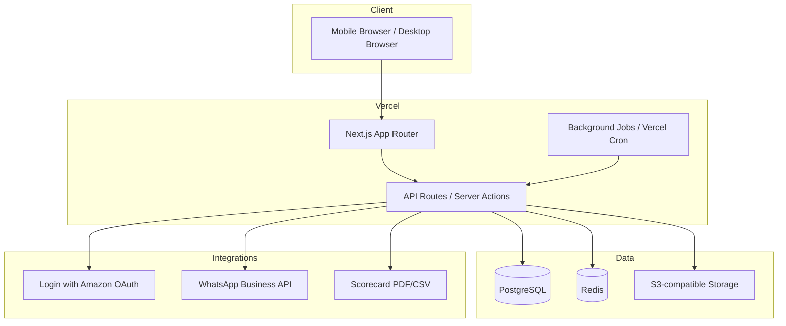

# Amazon DSP Driver Allocation System — Architecture Decision Record (ADR)

## 1. Overview and Architectural Style

**Decision:** Adopt a **full-stack, serverless-first web application** built with **Next.js 14+ (App Router)** deployed on **Vercel**, backed by **PostgreSQL** (Supabase / AWS RDS) and **Redis** (Upstash / ElastiCache).

**Style rationale:**
- A single Next.js codebase delivers both the mobile-first responsive UI and the API layer, minimizing context switching and deployment complexity for a small initial team.
- The workload is highly event-driven (availability window open/close, allocation runs, WhatsApp sends, scorecard imports), which maps well to serverless functions and background jobs.
- For ~100 drivers in one hub, a modular monolith inside Next.js is the right starting point. Domains are isolated into modules/routes so they can later be split into standalone services if multi-region scale demands it.
- Rejected pure microservices (too much operational overhead for 100 users) and static SPA + separate backend (more moving parts without clear benefit).

**Domain modules:**
- `auth` — Amazon OAuth login, domain gating, roles.
- `drivers` — registration, profile, vehicle restrictions, WhatsApp numbers.
- `availability` — weekly collection window.
- `vacancies` — daily vacancy publishing and Amazon-approved import.
- `allocation` — optimization/distribution algorithm.
- `schedule` — editable weekly grid and individual schedule rendering.
- `whatsapp` — message dispatch, delivery/read receipts.
- `scorecard` — PDF/CSV import and performance scoring.
- `audit` — change logs and compliance traces.

## 2. Frontend Technology

**Decision:**
- **Framework:** Next.js 14+ with App Router, React Server Components by default.
- **Language:** TypeScript (strict mode).
- **Styling:** Tailwind CSS for utility-first, mobile-first responsive design.
- **UI Components:** shadcn/ui or Radix-based primitives, customized for pt-BR.
- **State:** Server Actions for mutations; React Query / SWR for client-side cache of availability and schedule grids.
- **Schedule grid:** Virtualized or paginated data table (TanStack Table) for the 100-driver × 7-day matrix, with cell-level inline editing.

**Rationale:**
- Next.js App Router provides SSR/ISR for fast first paint on mobile networks and easy API colocation.
- Tailwind + shadcn/ui is a proven, low-ceremony stack for admin dashboards and mobile forms.
- The reference images (`Escala_individual_WA.jpg`, `Programacao_Semana33.jpg`) show tabular/grids, which TanStack Table handles well.

## 3. Backend Technology

**Decision:**
- **Runtime / Framework:** Node.js + Next.js API Routes + Server Actions.
- **Language:** TypeScript.
- **API Style:** Server Actions for domain mutations; REST/JSON API routes for third-party webhooks (WhatsApp status callbacks, scorecard import jobs).
- **Background jobs:** Vercel Cron for window open/close reminders; `inngest` or `bullmq` + Redis for heavier async work (allocation batch, WhatsApp blast, PDF parsing).
- **Validation:** Zod for all external inputs and API contracts.

**Rationale:**
- Keeping backend in the same Next.js repo reduces deployment surface and lets Server Actions directly call allocation/persistence logic.
- For the allocation algorithm and WhatsApp blast, an async job queue prevents request timeouts and provides retries.
- Rejected Python/FastAPI for the backend to avoid a second runtime and language; Node/TypeScript is sufficient for the allocation heuristic and integrates naturally with the Meta Cloud API and PDF parsers.

## 4. Database

**Decision:**
- **Primary database:** PostgreSQL 15+.
- **Hosting:** Supabase (managed Postgres + Auth helpers + storage) or AWS RDS if the organization already has an AWS footprint.
- **ORM:** Prisma.
- **Migrations:** Prisma Migrate, version-controlled.
- **Caching:** Redis for sessions, rate limiting, job queues, and hot schedule views.
- **File storage:** S3-compatible bucket (Supabase Storage or AWS S3) for scorecard PDFs, exported schedules, and generated schedule images.

**Key entities (high-level):**
- `User` (drivers, supervisors, account managers), `DriverProfile`, `VehicleRestriction`, `AvailabilityWeek`, `AvailabilityDay`, `VacancyWeek`, `VacancyDay`, `AllocationRun`, `ScheduleAssignment`, `ScorecardImport`, `AuditLog`, `WhatsAppMessage`.

**Rationale:**
- PostgreSQL handles relational schedule data, audit logs, and complex queries (e.g., consecutive-day windows) reliably.
- Prisma’s type safety and migration tooling fit a TypeScript-first team.
- Redis is required for job queues (BullMQ) and session/cache layers.

## 5. Authentication and Authorization

**Decision (revised 2026-08-11):**
- **Identity provider:** **Login with Amazon (LWA)** directly via OAuth 2.0, using `login.amazon.com` endpoints. AWS Cognito was originally planned but has been **replaced** by direct LWA integration.
- **Rationale for the change:** Direct LWA integration is simpler, avoids Cognito's operational overhead and cost, and provides the same Amazon OAuth experience required by RF-001. The LWA `profile` scope returns `user_id`, `name`, and `email` — sufficient for user identification and domain gating.
- **Implementation:** Auth.js (NextAuth v5) with a custom OAuth 2.0 provider configured for LWA endpoints:
  - Authorization: `https://www.amazon.com/ap/oa`
  - Token: `https://api.amazon.com/auth/o2/token`
  - User Profile: `https://api.amazon.com/user/profile`
  - Scope: `profile`
- **Domain restriction:** ~~Post-login middleware checks the e-mail domain against an allow-list (`@instalog.com.br` plus approved Amazon corporate domains). Unauthorized domains are blocked with a clear message.~~ **SUPERSEDED (2026-08-14):** O modelo de domínio corporativo foi substituído por uma lista fechada de e-mails pré-registrados (`allowed_emails`). Não há mais aprovação automática por domínio. Ver `docs/INFRA.md` para o modelo atual.
- **Role-based access control (RBAC):** Three roles mapped to requirements:
  - `DRIVER` — own data only (default role on first login).
  - `SUPERVISOR` — all schedules, drivers, and operational config.
  - `ACCOUNT_MANAGER` — full admin, reports, integrations, scorecard import, penalty flags.
- **Sessions:** Auth.js (NextAuth v5) with Prisma adapter; database-backed sessions in PostgreSQL; secure HTTP-only cookies, CSRF protection.
- **Onboarding:** First-login flow captures CPF, phone, vehicle type, restrictions, and links `Transporter ID`.

**Rationale:**
- Direct LWA provides the Amazon OAuth experience required by RF-001 without the complexity of Cognito user pools.
- Domain gating satisfies RNF-002 and RF-004.
- RBAC maps cleanly to the three stakeholder roles in section 2.

## 6. WhatsApp Business Integration

**Decision:**
- **Primary path:** **Meta WhatsApp Business Platform / Cloud API** directly.
- **Fallback path:** Verified WhatsApp Business Solution Provider (e.g., Twilio, 360dialog, Wati) if direct Cloud API onboarding is delayed.
- **Phone number:** Dedicated business phone number registered with Meta.
- **Message templates:** Pre-approved template for schedule delivery plus optional reminder templates.
- **Media:** Generated PNG/JPEG schedule card attached to the WhatsApp message.
- **Webhooks:** Inbound webhook for delivery (`delivered`) and read (`read`) statuses stored in `WhatsAppMessage` table.

**Rationale:**
- Direct Cloud API is the most cost-effective and transparent for a single Brazil operation.
- A BSP reduces setup friction but adds per-message markup; use it only if Meta verification is blocked.
- WhatsApp is the dominant channel for Brazilian drivers and explicitly required by RF-026.

## 7. File / Schedule Image Generation Strategy

**Decision:**
- **Individual schedule card:** Server-side HTML → image using **Puppeteer** or **Playwright** in an async job, or the lighter **html-to-image** / **satori** + **sharp** pipeline.
- **Recommendation:** Start with **Satori** (React-component-to-SVG) + **sharp** to PNG for fast, deterministic rendering of the reference card layout (blue/yellow header, day grid, footer text).
- **Weekly grid export:** Server-side PDF generation via **Playwright print-to-PDF** or **react-pdf** for supervisor exports/audits.
- **Storage:** Generated images/PDFs persisted to S3 and cached by Redis.

**Rationale:**
- Satori produces crisp, fixed-layout images ideal for WhatsApp cards without a full browser.
- Playwright/Puppeteer is kept as a fallback for complex PDF exports.
- Generating server-side ensures consistent fonts, layout, and pt-BR text regardless of the driver’s device.

## 8. Deployment and Hosting Strategy

**Decision:**
- **Application hosting:** Vercel with three environments:
  - `development` — branch previews.
  - `staging` — stable pre-production.
  - `production` — `amazon-dsp-allocation.instalog.com.br` (example).
- **Database:** Supabase project per environment (or AWS RDS dev/staging/prod instances).
- **Redis:** Upstash Redis per environment (or AWS ElastiCache).
- **Storage:** Supabase Storage / S3 buckets per environment.
- **Domains / DNS:** Vercel-managed DNS with SSL certificates auto-provisioned.
- **Brazil data residency:** Ensure Supabase/AWS region is `sa-east-1` (São Paulo) to keep LGPD-sensitive data in-country.

## 9. CI/CD and Testing Approach

**Decision:**
- **Source control:** GitHub.
- **CI/CD:** GitHub Actions → Vercel deployments.
- **Pipeline stages:**
  1. Lint (`eslint`) + Format (`prettier`) check.
  2. Type check (`tsc --noEmit`).
  3. Unit tests (`vitest` or `jest`) for allocation algorithm, domain rules, and utilities.
  4. Integration tests against a test database for API routes/Server Actions.
  5. E2E tests (`Playwright`) for critical flows: driver availability submission, supervisor allocation, schedule editing, WhatsApp mock send.
  6. Deploy to staging on PR merge; promote to production manually.
- **Environments / Secrets:** Managed in Vercel and GitHub Secrets; never committed.
- **Database branches:** Supabase branch/seed for PR previews if using Supabase.

## 10. Security, LGPD, and Compliance

**Decision:**
- **Encryption:** TLS 1.3 in transit; AES-256 at rest (managed by Supabase/AWS).
- **Sensitive data:** CPF and phone numbers encrypted at the application level (e.g., Prisma field encryption or pgcrypto) in addition to disk encryption.
- **Consent:** Explicit opt-in during driver onboarding for CPF and WhatsApp number collection; consent recorded in `AuditLog`.
- **Access:** Least-privilege RBAC; row-level security in PostgreSQL where applicable.
- **Audit:** Every manual schedule change writes an immutable `AuditLog` row (who, when, old value, new value, justification).
- **LGPD:** Data retention policy, right to deletion/export, privacy notice, DPO contact. Logs retained per legal minimum.
- **Secrets:** Managed via Vercel/GitHub Secrets; no secrets in repository.
- **Rate limiting:** Redis-based rate limiting on public endpoints (OAuth callbacks, WhatsApp webhooks).

## 11. Cost Estimates and Trade-offs

| Component | Estimated Monthly Cost (USD) | Notes |
|-----------|------------------------------|-------|
| Vercel Pro | ~$20–40 | Team plan with analytics, more build minutes. |
| Supabase / RDS Postgres | ~$25–150 | Scales with storage/IOPS; RDS is higher but fits existing AWS. |
| Upstash / ElastiCache Redis | ~$10–50 | Small instance/job queue. |
| Meta WhatsApp Cloud API | Usage-based | Brazil rates ~$0.03–0.06 per conversation; ~100 drivers × weekly send ≈ $15–30/mo. |
| BSP (if used) | +20–100% markup | Only if direct Cloud API is blocked. |
| S3/Storage | ~$5–20 | PDFs and generated schedule images. |
| PDF parsing / html-to-image | Included in compute | Vercel function duration limits apply; heavy parsing should run as async job. |
| **Total estimated** | **~$80–300/mo** | Highly dependent on Redis/DB choice and WhatsApp volume. |

**Key trade-offs:**
- **Supabase vs. AWS RDS:** Supabase is faster to set up and cheaper at this scale; AWS RDS simplifies compliance if the organization already has AWS governance.
- **Direct Cloud API vs. BSP:** Direct is cheaper but requires Meta Business verification; BSP is faster but costs more.
- **Satori vs. Puppeteer:** Satori is cheaper/faster; Puppeteer handles arbitrary HTML but requires more memory and longer function runtime.

## 12. Risks and Mitigation Strategies

| Risk | Impact | Mitigation |
|------|--------|------------|
| **Login with Amazon OAuth setup delays** | Blocks login | Keep a fallback e-mail magic-link or manual admin invite path for early pilots; document the LWA security profile creation steps. |
| **Meta WhatsApp Business verification rejection** | Blocks schedule delivery | Apply early; maintain BSP fallback (Twilio/360dialog); keep e-mail fallback for schedule delivery. |
| **Scorecard PDF format changes** | Breaks import | Build a tolerant parser with validation alerts; allow manual CSV upload fallback; notify admins of parse failures. |
| **Allocation algorithm complexity** | Delayed delivery / unfair schedules | Start with a rule-based heuristic (requirements order), add unit tests for edge cases, iterate with supervisor feedback before optimization. |
| **Driver adoption on mobile** | Low availability response | WhatsApp reminders before window closes; simple one-tap form; supervisor can fill on behalf of driver with audit. |
| **LGPD compliance gap** | Legal / fine risk | Privacy notice, explicit consent, encryption, access logs, data retention policy, and DPO contact before go-live. |
| **6-day consecutive rule across weeks** | Incorrect blocking | Persist published schedules; query previous week’s assignments during allocation run. |
| **Vercel function timeout on heavy jobs** | Failed allocation/WhatsApp blast | Move heavy work to async job queue (Inngest/BullMQ) outside request lifecycle. |

## 13. Open Questions Requiring Confirmation

1. **Scorecard source:** Will the Amazon scorecard arrive as PDF only, or is a CSV/Excel/API version available? (Affects parser strategy.)
2. **Favorites criteria:** Is "Fantastic Plus / Fantastic" sufficient, or does the account manager maintain a manual favorites list? (Affects scoring module.)
3. **Speed definition:** What exactly is a "Speed" shift — extra turn, special route, or vehicle category? (Affects status mapping.)
4. **Ciclo 2 / Tarde:** Are Ciclo 2 vacancies separate pools or additive to Ciclo 1? (Affects vacancy data model.)
5. **Regions/cities:** What is the complete list of regions/hubs/cities and should allocation respect driver home base? (Affects matching rules.)
6. **WhatsApp account:** Does ILLT already have a Meta Business Manager and verified WABA account? (Affects integration timeline.)
7. **Existing AWS accounts:** Is there an existing AWS organization where Cognito/RDS should live, or is green-field preferred? (Affects hosting decision.)
8. **Swap exceptions:** Under what exceptional conditions may supervisors authorize day swaps after WhatsApp send? (Affects audit/exception workflow.)

## 14. Recommended Next Steps

1. Validate the architectural choices and open questions with stakeholders.
2. Set up Vercel project + Supabase/AWS dev environment.
3. Create Cognito user pool / Amazon OAuth app and test domain gating.
4. Begin Meta WhatsApp Business Platform verification.
5. Draft data model in Prisma and run initial migration.
6. Implement driver onboarding + availability form as the first vertical slice.
7. Build allocation heuristic behind a feature flag for supervisor review.
