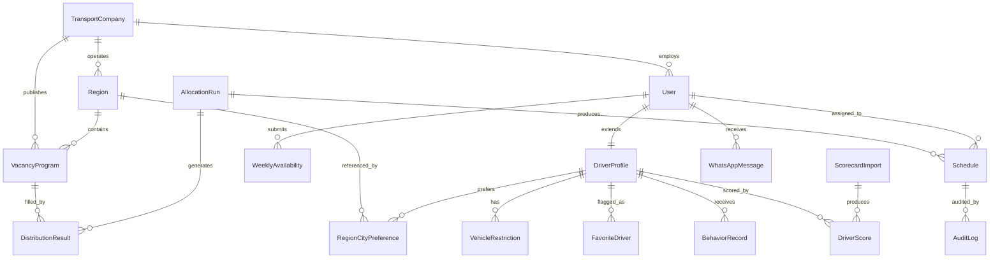
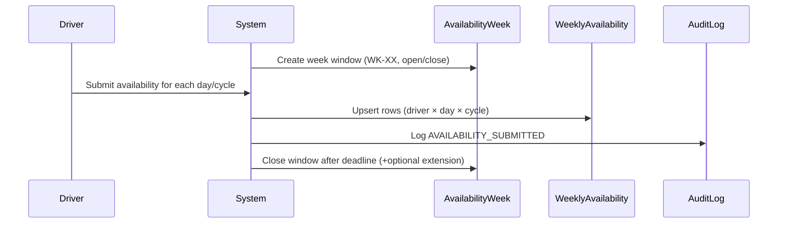
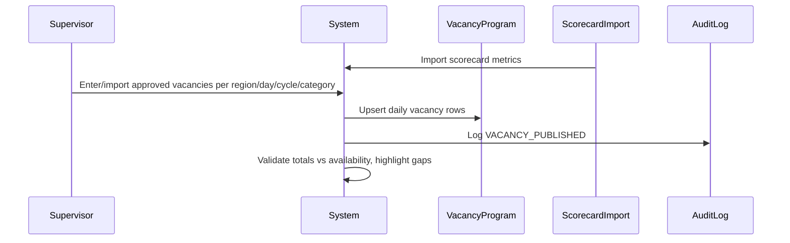
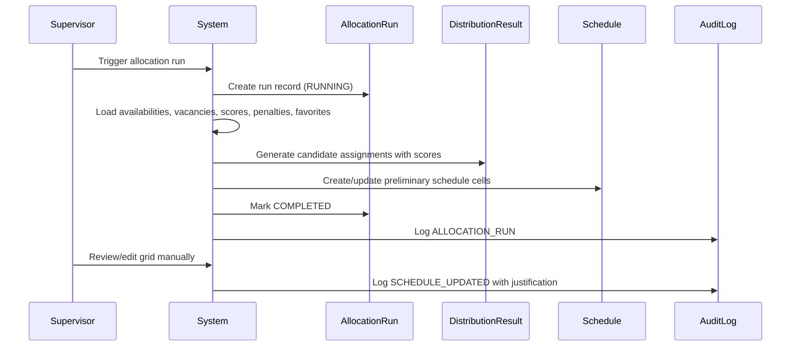
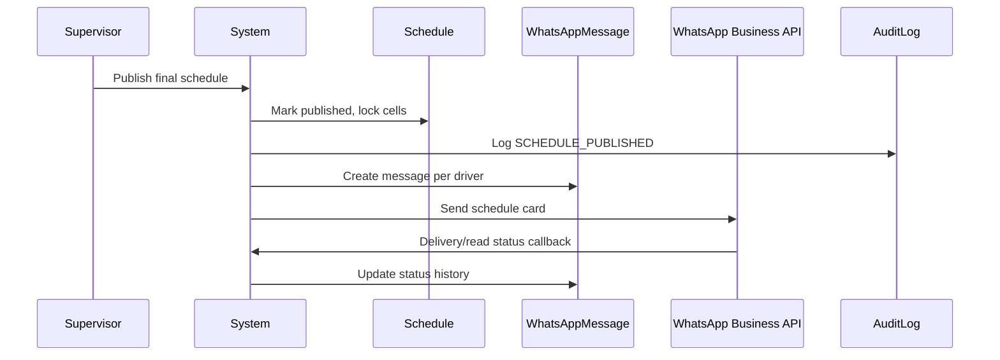

# Amazon DSP Driver Allocation System — Data Model

## 1. Domain Overview and Entity Relationships

The system allocates delivery drivers (DAs) to daily shifts/vacancies for Amazon DSP operations. The core entities are:

- **TransportCompany / DSP** — the logistics operator (ILLT) and the hubs it serves.
- **Region** — operational hubs such as XSP7, ELP7, DSP5, plus future regions.
- **User / DriverProfile** — authenticated users (drivers, supervisors, account managers) and driver-specific attributes.
- **VehicleRestriction** — vehicle capabilities/restrictions a driver declares (GNV, fridge, reduced capacity, passenger car).
- **WeeklyAvailability** — driver's availability for a specific week/day/cycle.
- **VacancyProgram** — approved daily vacancies per week/region/day/cycle/vehicle category.
- **AllocationRun / DistributionResult** — execution trace and output of the automatic allocation algorithm.
- **Schedule / Roster** — final or preliminary driver-to-vacancy assignments.
- **ScorecardImport / DriverScore** — imported Amazon DSP scorecard metrics and derived performance classification.
- **BehaviorRecord** — penalties, warnings, and exceptions applied to drivers with effective week ranges.
- **WhatsAppMessage** — outbound messages and delivery/read receipts.
- **AuditLog** — immutable record of manual changes and business events.
- **FavoriteDriver** — explicit favorite flag, typically derived from Fantastic Plus/Fantastic scorecard status but overridable by account managers.
- **RegionCityPreference** — driver region/city/home-base preferences used for matching.

### High-level ER diagram



---

## 2. Entity Dictionary

| Entity | Description | Source of truth |
|--------|-------------|-----------------|
| `TransportCompany` | DSP operator (e.g., ILLT) and its metadata. | Onboarding / admin config |
| `Region` | Operational hub (XSP7, ELP7, DSP5, etc.). | Admin config |
| `User` | Any authenticated person; role and OAuth identity. | Amazon Cognito + onboarding |
| `DriverProfile` | Driver-specific data: CPF, phone, vehicle type, transporterId, cities. | Driver onboarding |
| `VehicleRestriction` | One capability/restriction per row (GNV, fridge, etc.). | Driver onboarding |
| `WeeklyAvailability` | One row per driver/week/day/cycle. | Availability form |
| `VacancyProgram` | One row per week/region/day/cycle/vehicle-category. | Supervisor / Amazon import |
| `AllocationRun` | One algorithm execution per week/region. | System |
| `DistributionResult` | One row per allocation assignment candidate. | Allocation algorithm |
| `Schedule` | Final published/preliminary roster cell (driver × day × cycle). | Allocation + manual edits |
| `ScorecardImport` | Batch import of scorecard file. | Admin upload |
| `DriverScore` | One row per driver per import with metrics and classification. | Scorecard parser |
| `BehaviorRecord` | Penalty, warning, or exception with effective week range. | Account manager |
| `WhatsAppMessage` | Message log with status and media references. | WhatsApp integration |
| `AuditLog` | Immutable change record. | Manual edits / system events |
| `FavoriteDriver` | Favorite flag per driver per week with optional manual override. | Scorecard / account manager |
| `RegionCityPreference` | Driver city/region preference for matching. | Driver onboarding |

---

## 3. Complete Prisma Schema

```prisma
// schema.prisma — Amazon DSP Driver Allocation System

generator client {
  provider = "prisma-client-js"
}

datasource db {
  provider = "postgresql"
  url      = env("DATABASE_URL")
}

// ---------- Enums ----------

enum UserRole {
  DRIVER
  SUPERVISOR
  ACCOUNT_MANAGER
}

enum WeekDay {
  DOMINGO
  SEGUNDA
  TERCA
  QUARTA
  QUINTA
  SEXTA
  SABADO
}

enum Cycle {
  CICLO_1       // Manhã
  CICLO_2       // Tarde / Speed (to be confirmed)
  SPEED
}

enum AvailabilityAnswer {
  SIM           // Disponível
  NAO           // Indisponível
  CICLO_2       // Disponível apenas no Ciclo 2 / Tarde
}

enum VehicleType {
  CARGO_VAN
  PASSEIO
}

enum VehicleRestrictionCode {
  GNV              // kit gás / GNV (canonical)
  REFRIGERADOR     // refrigerated
  CAPACIDADE_REDUZIDA
  NATURAL_GAS      // @deprecated — legacy duplicate of GNV; retained for historical data only, not writable
}

enum VacancyStatus {
  RASCUNHO
  PUBLICADA
  FECHADA
}

enum ScheduleStatus {
  SIM              // Alocado
  SEM_ESCALA       // 7º dia consecutivo / limite atingido
  A_CONFIRMAR      // Disponível mas sem vaga suficiente
  NAO              // Não informou disponibilidade
  SPEED            // Turno extra/especial
  FALTA            // Falta no dia
}

enum ScorecardClassification {
  FANTASTIC_PLUS
  FANTASTIC
  GREAT
  FAIR
  POOR
}

enum BehaviorType {
  ADVERTENCIA
  SUSPENSAO_ALOCACAO
  PENALIDADE_PONTUACAO
  EXCECAO          // excepcional override aprovado pelo supervisor
}

enum WhatsAppMessageStatus {
  PENDING
  SCHEDULED
  SENT
  DELIVERED
  READ
  FAILED
}

enum AuditEventType {
  LOGIN
  LOGOUT
  AVAILABILITY_SUBMITTED
  AVAILABILITY_UPDATED
  VACANCY_PUBLISHED
  VACANCY_UPDATED
  ALLOCATION_RUN
  SCHEDULE_CREATED
  SCHEDULE_UPDATED
  SCHEDULE_PUBLISHED
  WHATSAPP_SENT
  SCORECARD_IMPORTED
  BEHAVIOR_RECORD_CREATED
  BEHAVIOR_RECORD_UPDATED
  MANUAL_OVERRIDE
  CONSENT_GIVEN
  CONSENT_REVOKED
}

// ---------- Core Entities ----------

model TransportCompany {
  id            String   @id @default(uuid())
  name          String
  legalName     String?
  cnpj          String?  @unique // Brazilian corporate ID
  amazonDspId   String?  @unique // Amazon DSP identifier
  active        Boolean  @default(true)
  createdAt     DateTime @default(now())
  updatedAt     DateTime @updatedAt

  regions       Region[]
  users         User[]
  vacancyPrograms VacancyProgram[]

  @@map("transport_companies")
}

model Region {
  id                  String   @id @default(uuid())
  transportCompanyId  String
  code                String   // XSP7, ELP7, DSP5
  name                String
  city                String?
  state               String?  // SP, RJ, etc.
  active              Boolean  @default(true)
  createdAt           DateTime @default(now())
  updatedAt           DateTime @updatedAt

  transportCompany    TransportCompany @relation(fields: [transportCompanyId], references: [id])
  vacancyPrograms     VacancyProgram[]
  regionPreferences   RegionCityPreference[]

  @@unique([transportCompanyId, code])
  @@map("regions")
}

model User {
  id                    String    @id @default(uuid())
  transportCompanyId    String?
  email                 String    @unique
  name                  String
  role                  UserRole
  amazonSub             String?   @unique // Amazon OAuth subject
  amazonAccessToken     String?   // encrypted at application level
  amazonRefreshToken    String?   // encrypted at application level
  amazonTokenExpiresAt  DateTime?
  emailVerified         Boolean   @default(false)
  active                Boolean   @default(true)
  lastLoginAt           DateTime?
  createdAt             DateTime  @default(now())
  updatedAt             DateTime  @updatedAt

  transportCompany      TransportCompany?    @relation(fields: [transportCompanyId], references: [id])
  driverProfile         DriverProfile?
  availabilities        WeeklyAvailability[]
  schedules             Schedule[]
  whatsAppMessages      WhatsAppMessage[]
  auditLogs             AuditLog[]
  allocationRuns        AllocationRun[]

  @@index([email])
  @@index([role, active])
  @@map("users")
}

model DriverProfile {
  id                  String      @id @default(uuid())
  userId              String      @unique
  cpf                 String?     @unique // encrypted at application level
  phone               String?     // encrypted at application level
  phoneFormatted      String?     // E.164 + display format
  vehicleType         VehicleType @default(CARGO_VAN)
  transporterId       String?     // Amazon Transporter ID
  onboardingCompleted Boolean     @default(false)
  createdAt           DateTime    @default(now())
  updatedAt           DateTime    @updatedAt

  user                User        @relation(fields: [userId], references: [id], onDelete: Cascade)
  vehicleRestrictions VehicleRestriction[]
  regionPreferences   RegionCityPreference[]
  favoriteFlags       FavoriteDriver[]
  behaviorRecords     BehaviorRecord[]
  driverScores        DriverScore[]

  @@index([transporterId])
  @@map("driver_profiles")
}

model VehicleRestriction {
  id               String                 @id @default(uuid())
  driverProfileId  String
  code             VehicleRestrictionCode
  notes            String?
  createdAt        DateTime               @default(now())

  driverProfile    DriverProfile          @relation(fields: [driverProfileId], references: [id], onDelete: Cascade)

  @@unique([driverProfileId, code])
  @@map("vehicle_restrictions")
}

model RegionCityPreference {
  id              String        @id @default(uuid())
  driverProfileId String?
  regionId        String?
  city            String?
  priority        Int           @default(1) // 1 = primary
  createdAt       DateTime      @default(now())

  driverProfile   DriverProfile? @relation(fields: [driverProfileId], references: [id], onDelete: Cascade)
  region          Region?         @relation(fields: [regionId], references: [id])

  @@index([driverProfileId])
  @@index([regionId])
  @@map("region_city_preferences")
}

// ---------- Availability ----------

model AvailabilityWeek {
  id            String   @id @default(uuid())
  weekKey       String   // e.g., WK-31
  year          Int
  weekNumber    Int      // ISO/Amazon week number
  opensAt       DateTime
  closesAt      DateTime
  extendedUntil DateTime?
  status        String   @default("OPEN") // OPEN, CLOSED
  createdAt     DateTime @default(now())
  updatedAt     DateTime @updatedAt

  days WeeklyAvailability[]

  @@unique([year, weekNumber])
  @@index([weekKey])
  @@map("availability_weeks")
}

model WeeklyAvailability {
  id                  String             @id @default(uuid())
  availabilityWeekId  String
  userId              String
  day                 WeekDay
  cycle               Cycle              @default(CICLO_1)
  answer              AvailabilityAnswer
  submittedAt         DateTime           @default(now())
  updatedAt           DateTime           @updatedAt

  availabilityWeek    AvailabilityWeek   @relation(fields: [availabilityWeekId], references: [id], onDelete: Cascade)
  user                User               @relation(fields: [userId], references: [id], onDelete: Cascade)

  @@unique([availabilityWeekId, userId, day, cycle])
  @@index([availabilityWeekId, userId])
  @@index([userId, availabilityWeekId])
  @@map("weekly_availabilities")
}

// ---------- Vacancies ----------

model VacancyProgram {
  id                  String        @id @default(uuid())
  transportCompanyId  String
  regionId            String
  weekKey             String        // WK-XX
  year                Int
  weekNumber          Int
  day                 WeekDay
  cycle               Cycle         @default(CICLO_1)
  vehicleCategory     String        // e.g., "Small R2.0 BR", "Inside Natural Gas", "Passenger"
  vehicleType         VehicleType?  // optional normalized type
  quantity            Int
  status              VacancyStatus @default(RASCUNHO)
  source              String?       // MANUAL, AMAZON_IMPORT
  createdById         String?
  createdAt           DateTime      @default(now())
  updatedAt           DateTime      @updatedAt

  transportCompany    TransportCompany @relation(fields: [transportCompanyId], references: [id])
  region              Region           @relation(fields: [regionId], references: [id])
  distributionResults DistributionResult[]

  @@unique([regionId, year, weekNumber, day, cycle, vehicleCategory])
  @@index([weekKey, regionId])
  @@index([regionId, year, weekNumber])
  @@index([status])
  @@map("vacancy_programs")
}

// ---------- Allocation ----------

model AllocationRun {
  id                  String   @id @default(uuid())
  weekKey             String
  year                Int
  weekNumber          Int
  regionId            String?
  triggeredById       String
  triggerType         String   // AUTO, MANUAL, REEXECUTE
  status              String   @default("RUNNING") // RUNNING, COMPLETED, FAILED
  configSnapshot      Json?    // JSON copy of rules/weights used
  startedAt           DateTime @default(now())
  finishedAt          DateTime?
  errorMessage        String?
  createdAt           DateTime @default(now())

  triggeredBy         User     @relation(fields: [triggeredById], references: [id])
  results             DistributionResult[]
  schedules           Schedule[]

  @@index([weekKey, regionId])
  @@index([status])
  @@map("allocation_runs")
}

model DistributionResult {
  id                  String          @id @default(uuid())
  allocationRunId     String
  vacancyProgramId    String
  driverProfileId     String
  day                 WeekDay
  cycle               Cycle
  score               Float           @default(0) // computed priority score
  matchedVehicleType  Boolean         @default(false)
  matchedRegionPref   Boolean         @default(false)
  isFavorite          Boolean         @default(false)
  behaviorPenalty     Float           @default(0)
  consecutiveDaysBefore Int?
  assigned            Boolean         @default(false)
  reason              String?         // why assigned or not
  createdAt           DateTime        @default(now())

  allocationRun       AllocationRun   @relation(fields: [allocationRunId], references: [id], onDelete: Cascade)
  vacancyProgram      VacancyProgram  @relation(fields: [vacancyProgramId], references: [id], onDelete: Cascade)

  @@index([allocationRunId, driverProfileId])
  @@index([allocationRunId, vacancyProgramId])
  @@map("distribution_results")
}

// ---------- Schedule / Roster ----------

model Schedule {
  id                  String         @id @default(uuid())
  allocationRunId     String?
  userId              String
  regionId            String
  weekKey             String
  year                Int
  weekNumber          Int
  day                 WeekDay
  cycle               Cycle          @default(CICLO_1)
  status              ScheduleStatus
  vehicleCategory     String?        // actual vacancy category filled
  overrideById        String?        // supervisor who manually changed
  overrideReason      String?
  overrideAt          DateTime?
  publishedAt         DateTime?
  publishedById       String?
  isLocked            Boolean        @default(false) // after WhatsApp send
  createdAt           DateTime       @default(now())
  updatedAt           DateTime       @updatedAt

  allocationRun       AllocationRun? @relation(fields: [allocationRunId], references: [id])
  user                User           @relation(fields: [userId], references: [id])

  auditLogs           AuditLog[]

  @@unique([userId, year, weekNumber, day, cycle, regionId])
  @@index([weekKey, regionId])
  @@index([userId, year, weekNumber])
  @@index([status, isLocked])
  @@map("schedules")
}

// ---------- Scorecard ----------

model ScorecardImport {
  id                  String       @id @default(uuid())
  weekKey             String
  year                Int
  weekNumber          Int
  fileName            String
  fileUrl             String?      // S3/Storage URL
  importedById        String?
  status              String       @default("PROCESSING") // PROCESSING, COMPLETED, FAILED
  errors              Json?
  processedAt         DateTime?
  createdAt           DateTime     @default(now())

  driverScores        DriverScore[]

  @@index([weekKey])
  @@index([status])
  @@map("scorecard_imports")
}

model DriverScore {
  id                  String                  @id @default(uuid())
  scorecardImportId   String
  driverProfileId     String
  daRank              Int?
  transporterId       String?
  totalScore          Float?
  delivered           Int?
  dcr                 Float?
  dnrDpmo             Float?
  contactCompliance   Float?
  scanCompliance      Float?
  whExceptionFlag     Boolean?
  swaOta              Float?
  swipeToFinishCompliance Float?
  workHourCompliance  Float?
  attrition           Float?
  dspLateCancellationRate Float?
  classification      ScorecardClassification?
  isFavorite          Boolean                 @default(false)
  createdAt           DateTime                @default(now())

  scorecardImport     ScorecardImport         @relation(fields: [scorecardImportId], references: [id], onDelete: Cascade)
  driverProfile       DriverProfile           @relation(fields: [driverProfileId], references: [id], onDelete: Cascade)

  @@unique([scorecardImportId, driverProfileId])
  @@index([driverProfileId, scorecardImportId])
  @@map("driver_scores")
}

// ---------- Behavior & Favorites ----------

model FavoriteDriver {
  id                  String    @id @default(uuid())
  driverProfileId     String
  weekKey             String
  year                Int
  weekNumber          Int
  isFavorite          Boolean   @default(true)
  source              String    @default("SCORECARD") // SCORECARD, MANUAL
  manualOverrideById  String?
  createdAt           DateTime  @default(now())
  updatedAt           DateTime  @updatedAt

  driverProfile       DriverProfile @relation(fields: [driverProfileId], references: [id], onDelete: Cascade)

  @@unique([driverProfileId, year, weekNumber])
  @@index([weekKey])
  @@map("favorite_drivers")
}

model BehaviorRecord {
  id                  String       @id @default(uuid())
  driverProfileId     String
  type                BehaviorType
  description         String
  severity            Int          @default(1) // 1 light, 5 severe
  effectiveFromWeek   String       // WK-XX
  effectiveToWeek     String?      // null = indefinite
  impactScore         Float        @default(0) // points to subtract from priority
  approvedById        String?
  createdAt           DateTime     @default(now())
  updatedAt           DateTime     @updatedAt

  driverProfile       DriverProfile @relation(fields: [driverProfileId], references: [id], onDelete: Cascade)

  @@index([driverProfileId, effectiveFromWeek])
  @@index([type, effectiveFromWeek])
  @@map("behavior_records")
}

// ---------- WhatsApp ----------

model WhatsAppMessage {
  id                  String                @id @default(uuid())
  userId              String
  scheduleId          String?
  weekKey             String?
  templateName        String?
  body                String                @db.Text
  mediaUrl            String?               // generated schedule card image
  externalMessageId   String?               // Meta message id
  status              WhatsAppMessageStatus @default(PENDING)
  statusHistory       Json?                 // [{ status, at }]
  sentAt              DateTime?
  deliveredAt         DateTime?
  readAt              DateTime?
  failedReason        String?
  createdAt           DateTime              @default(now())
  updatedAt           DateTime              @updatedAt

  user                User                  @relation(fields: [userId], references: [id], onDelete: Cascade)
  schedule            Schedule?             @relation(fields: [scheduleId], references: [id])

  @@index([userId, weekKey])
  @@index([externalMessageId])
  @@index([status])
  @@map("whatsapp_messages")
}

// ---------- Audit ----------

model AuditLog {
  id                  String         @id @default(uuid())
  eventType           AuditEventType
  actorId             String?        // user who performed the action
  targetUserId        String?        // affected user, if any
  scheduleId          String?
  allocationRunId     String?
  oldValue            Json?
  newValue            Json?
  justification       String?
  metadata            Json?
  ipAddress           String?
  userAgent           String?
  createdAt           DateTime       @default(now())

  actor               User?          @relation(fields: [actorId], references: [id], onDelete: SetNull)
  schedule            Schedule?      @relation(fields: [scheduleId], references: [id], onDelete: SetNull)

  @@index([eventType, createdAt])
  @@index([actorId, createdAt])
  @@index([scheduleId])
  @@index([targetUserId])
  @@map("audit_logs")
}
```

---

## 4. Indexes and Constraints

| Purpose | Index / Constraint | Location |
|---------|-------------------|----------|
| Fast driver lookup by e-mail | `@@index([email])` | `User` |
| Active role queries | `@@index([role, active])` | `User` |
| Unique CPF (encrypted) | `@unique` | `DriverProfile.cpf` |
| Transporter ID search | `@@index([transporterId])` | `DriverProfile` |
| One restriction per type per driver | `@@unique([driverProfileId, code])` | `VehicleRestriction` |
| One availability per driver/day/cycle/week | `@@unique([availabilityWeekId, userId, day, cycle])` | `WeeklyAvailability` |
| Region + code uniqueness | `@@unique([transportCompanyId, code])` | `Region` |
| One vacancy per region/day/cycle/category/week | `@@unique([regionId, year, weekNumber, day, cycle, vehicleCategory])` | `VacancyProgram` |
| Schedule cell uniqueness | `@@unique([userId, year, weekNumber, day, cycle, regionId])` | `Schedule` |
| One score per driver per import | `@@unique([scorecardImportId, driverProfileId])` | `DriverScore` |
| One favorite flag per driver per week | `@@unique([driverProfileId, year, weekNumber])` | `FavoriteDriver` |
| Audit query by event/time | `@@index([eventType, createdAt])` | `AuditLog` |
| WhatsApp status polling | `@@index([status])` | `WhatsAppMessage` |

---

## 5. Enum Definitions and pt-BR Meanings

| Enum | Value | Meaning (pt-BR) |
|------|-------|-----------------|
| `UserRole` | `DRIVER` | Motorista / DA |
| `UserRole` | `SUPERVISOR` | Supervisor de Operações |
| `UserRole` | `ACCOUNT_MANAGER` | Gerente de Contas |
| `WeekDay` | `DOMINGO` ... `SABADO` | Domingo a Sábado (semana operacional) |
| `Cycle` | `CICLO_1` | Manhã |
| `Cycle` | `CICLO_2` | Tarde (a confirmar se é mesmo Speed) |
| `Cycle` | `SPEED` | Turno extra/especial |
| `AvailabilityAnswer` | `SIM` | Disponível |
| `AvailabilityAnswer` | `NAO` | Indisponível |
| `AvailabilityAnswer` | `CICLO_2` | Disponível apenas no Ciclo 2 / Tarde |
| `VehicleType` | `CARGO_VAN` | Cargo Van |
| `VehicleType` | `PASSEIO` | Passeio |
| `ScheduleStatus` | `SIM` | Alocado na vaga |
| `ScheduleStatus` | `SEM_ESCALA` | 7º dia / limite de 6 dias consecutivos |
| `ScheduleStatus` | `A_CONFIRMAR` | Disponível, mas sem vaga suficiente |
| `ScheduleStatus` | `NAO` | Não informou disponibilidade |
| `ScheduleStatus` | `SPEED` | Alocação em turno extra/especial |
| `ScheduleStatus` | `FALTA` | Falta no dia |
| `ScorecardClassification` | `FANTASTIC_PLUS` | Fantastic Plus |
| `ScorecardClassification` | `FANTASTIC` | Fantastic |
| `ScorecardClassification` | `GREAT` | Great |
| `ScorecardClassification` | `FAIR` | Fair |
| `ScorecardClassification` | `POOR` | Poor |
| `BehaviorType` | `ADVERTENCIA` | Advertência |
| `BehaviorType` | `SUSPENSAO_ALOCACAO` | Suspensão temporária de alocação |
| `BehaviorType` | `PENALIDADE_PONTUACAO` | Penalidade de pontuação |
| `BehaviorType` | `EXCECAO` | Exceção aprovada pelo supervisor |

---

## 6. Data Flow Diagrams

### 6.1 Availability Collection Flow



### 6.2 Vacancy Publishing Flow



### 6.3 Allocation Flow



### 6.4 Schedule Sending Flow



---

## 7. Assumptions and Open Questions

### 7.1 Assumptions

| ID | Assumption |
|----|-----------|
| A-DM-01 | A week is identified as `WK-XX` where `XX` follows the Amazon operational calendar (Sunday = first day). |
| A-DM-02 | One driver can have multiple availability rows per day if multi-cycle support is needed (`CICLO_1`, `CICLO_2`). |
| A-DM-03 | `Cycle.CICLO_2` and `Cycle.SPEED` are modeled separately so they can be merged or kept distinct once business rules are confirmed. |
| A-DM-04 | Scorecard classification determines the automatic `FavoriteDriver` flag, but account managers can override it manually. |
| A-DM-05 | Consecutive-day calculation spans published schedules from the previous week. |
| A-DM-06 | CPF and phone are encrypted at the application level before persistence. |
| A-DM-07 | A transport company can operate multiple regions; each region has independent vacancy programs but shared drivers. |
| A-DM-08 | Manual schedule edits are allowed until the schedule is published and WhatsApp messages are sent, after which cells become locked unless a supervisor records an exception. |
| A-DM-09 | `VehicleRestrictionCode.GNV` is the canonical code for Natural Gas Vehicles with reduced cargo volume. `NATURAL_GAS` is a legacy duplicate retained only for historical data; it is not writable through any path (onboarding, supervisor screen, or scripts). GNV drivers can only be assigned to "Inside Natural Gas" vacancy categories, which have smaller capacity. Supervisors (and above) can set or clear this marking on any driver. |

### 7.2 Open Questions

| ID | Question | Impact |
|----|----------|--------|
| Q-DM-01 | Is `Ciclo 2` the same as `Tarde` and/or `Speed`, or are they three distinct concepts? | Enum design for `Cycle` and matching logic. |
| Q-DM-02 | Are Ciclo 2 vacancies a separate pool, or additive to Ciclo 1 totals? | `VacancyProgram` modeling and allocation algorithm. |
| Q-DM-03 | What is the exact business rule for the `Speed` status? Is it a shift type, vehicle category, or performance reward? | `ScheduleStatus.SPEED` semantics and UI. |
| Q-DM-04 | Should allocation respect the driver's home city/base, or only declared region preferences? | `RegionCityPreference` matching weight. |
| Q-DM-05 | Does "Speed" status require a separate vacancy category or is it derived from driver performance? | `VacancyProgram.vehicleCategory` values. |
| Q-DM-06 | How often is the scorecard imported, and in what format (PDF, CSV, API)? | `ScorecardImport` parser and frequency. |
| Q-DM-07 | Is the "+1 turno semanal" for favorites a hard guarantee or a tie-breaker? | Allocation scoring formula. |
| Q-DM-08 | What are the exact weights for behavior penalties and scorecard classifications? | `DistributionResult.score` computation. |
| Q-DM-09 | Are there any weekly day-off rules beyond the 6-day consecutive limit? | `Schedule` validation rules. |
| Q-DM-10 | Should manual overrides after WhatsApp send require a second approval level? | `Schedule.isLocked` exception workflow. |
