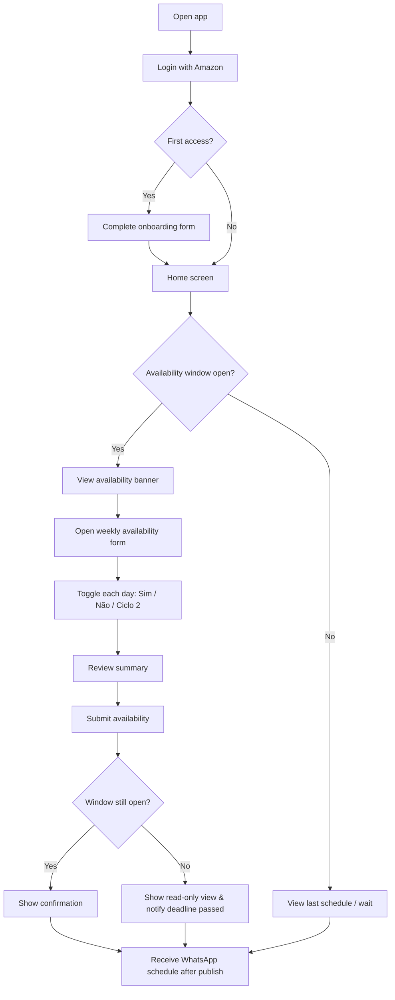
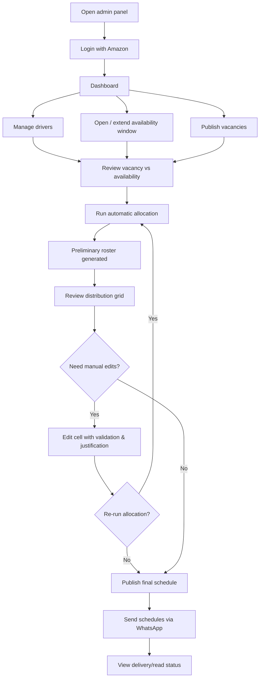
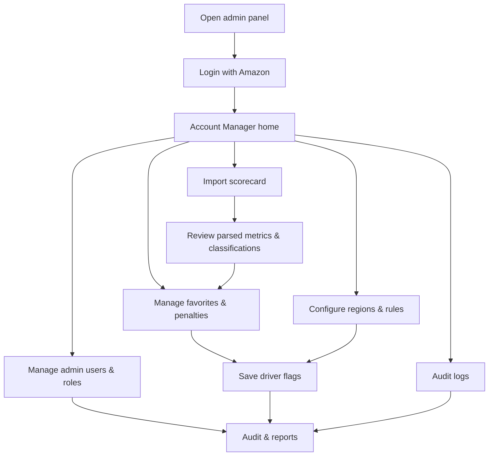

# Amazon DSP Driver Allocation System — UX Flows & Wireframes

**Date:** 2026-08-07  
**Based on:** `requirements.md` v1.0 (ILLT / Amazon DSP XSP7)  
**Target platforms:** Mobile-first web app for drivers; desktop-optimized admin panel for supervisors and account managers.  
**Design language:** [shadcn/ui](https://ui.shadcn.com/) components + Tailwind CSS utility classes.

---

## 1. User Personas and Their Goals

### 1.1 Driver (Delivery Associate — DA)

| Attribute | Detail |
|-----------|--------|
| Profile | Self-employed or contracted delivery driver who owns or operates a vehicle. Accesses the system mostly on a smartphone. |
| Primary goals | <ul><li>Log in quickly with existing Amazon/DSP credentials.</li><li>Complete registration once and keep profile updated.</li><li>Inform availability for the upcoming week within the collection window.</li><li>See the resulting individual schedule as soon as it is published.</li><li>Receive the schedule on WhatsApp for easy reference.</li></ul> |
| Pain points | <ul><li>Confusing or lengthy forms on mobile.</li><li>Missing the availability deadline.</li><li>Not understanding why a day was marked “Sem Escala” or “à Confirmar”.</li></ul> |
| Success metrics | <ul><li>Availability form completed in under 2 minutes.</li><li>Zero missed deadlines due to reminder failures.</li><li>Schedule received and read on WhatsApp.</li></ul> |

### 1.2 Operations Supervisor

| Attribute | Detail |
|-----------|--------|
| Profile | Operations lead responsible for publishing vacancies, running the allocation algorithm, and approving exceptions. Works from desktop during office hours but may check the dashboard on mobile. |
| Primary goals | <ul><li>Publish daily vacancies for the upcoming week per region/cycle/vehicle type.</li><li>Run and re-run automatic allocation safely.</li><li>Manually adjust the roster while respecting business rules.</li><li>Identify under- or over-allocated days at a glance.</li><li>Publish the final schedule and trigger WhatsApp dispatch.</li></ul> |
| Pain points | <ul><li>Manual allocation errors (more than 6 consecutive days, wrong vehicle type).</li><li>No visibility into why a driver was/was not allocated.</li><li>Difficult to compare vacancies against availability.</li></ul> |
| Success metrics | <ul><li>Roster published in under 15 minutes after availability closes.</li><li>Zero rule violations published.</li><li>All schedules sent via WhatsApp successfully.</li></ul> |

### 1.3 Account Manager

| Attribute | Detail |
|-----------|--------|
| Profile | Administrative owner of the system, responsible for compliance, configuration, and integration with Amazon scorecards. |
| Primary goals | <ul><li>Manage user accounts and role-based access.</li><li>Import and reconcile Amazon DSP scorecard data.</li><li>Apply favorite/penalty flags and behavioral adjustments.</li><li>Configure regions, rules, and operational parameters.</li><li>Audit all manual changes and exceptions.</li></ul> |
| Pain points | <ul><li>Scorecard import formats change frequently.</li><li>Hard to trace why a driver was prioritized/penalized.</li><li>Unclear impact of configuration changes on allocation.</li></ul> |
| Success metrics | <ul><li>Scorecard imported and processed within 24 hours of receipt.</li><li>100% of manual adjustments logged with justification.</li><li>System rules match operational reality.</li></ul> |

---

## 2. Complete User Flows

### 2.1 Driver Flow

**Step-by-step:**

1. Driver opens the mobile web app.
2. Taps **Entrar com Amazon**.
3. Amazon OAuth redirects back to the app.
4. On first access, driver completes the onboarding form (name, CPF, email, WhatsApp, vehicle type, vehicle restrictions).
5. Driver lands on the home screen.
6. If the availability window is open, a banner invites the driver to fill availability.
7. Driver opens the **Disponibilidade Semanal** screen.
8. Driver toggles each day (Dom–Sáb) to **Sim**, **Não**, or **Ciclo 2 / Tarde**.
9. Driver reviews the summary.
10. Driver submits the form.
11. System validates the window is still open and stores the response.
12. Driver sees a confirmation screen with the deadline and a reminder that the schedule will arrive via WhatsApp.
13. After the supervisor publishes the schedule, the driver receives the individual schedule on WhatsApp and can view it in the app.

**Mermaid diagram:**



---

### 2.2 Supervisor Flow

**Step-by-step:**

1. Supervisor opens the admin panel on desktop or mobile.
2. Logs in with Amazon OAuth.
3. Lands on the dashboard showing the current week status, open windows, and alerts.
4. Supervisor reviews and manages drivers (add/edit/deactivate, verify vehicle restrictions).
5. Supervisor opens or extends the availability collection window for the upcoming week.
6. Supervisor publishes vacancies for each day (Dom–Sáb), per cycle and vehicle category.
7. Supervisor reviews the vacancy vs. availability summary.
8. Supervisor runs the automatic allocation algorithm.
9. System generates a preliminary roster.
10. Supervisor reviews the editable distribution grid, spots warnings (unfilled vacancies, over-allocation, rule violations).
11. Supervisor edits individual cells if needed, with validation and justification.
12. Supervisor re-runs allocation if major changes are made.
13. Supervisor publishes the final schedule.
14. System sends each driver their individual schedule via WhatsApp Business.
15. Supervisor views send status (delivered/read) and handles failures.

**Mermaid diagram:**



---

### 2.3 Account Manager Flow

**Step-by-step:**

1. Account Manager opens the admin panel.
2. Logs in with Amazon OAuth.
3. Navigates to **Usuários** to manage admin users and roles.
4. Imports the latest Amazon DSP scorecard (PDF or file upload).
5. Reviews parsed metrics and classification (Fantastic Plus → Poor).
6. Updates favorite and penalty flags per driver.
7. Configures regions, hubs, vehicle categories, and allocation rules.
8. Opens the audit log to review manual changes, justifications, and exceptions.
9. Exports reports if needed.

**Mermaid diagram:**



---

## 3. Key Screen Descriptions

### 3.1 Login Screen

**Purpose:** Authenticate drivers and managers via Amazon OAuth.  
**Primary users:** All roles.  
**Layout:** Centered card, mobile-first.

| Element | Description |
|---------|-------------|
| Logo | ILLT + Amazon DSP co-branded header. |
| Title | “Acesso ao Sistema de Escala” |
| CTA | Primary button **Entrar com Amazon** (Amazon orange/dark styling, shadcn `Button` variant). |
| Helper text | “Use seu e-mail corporativo autorizado.” |
| Error state | If domain is not authorized, show inline alert: `shadcn/Alert` with variant `destructive`. |

**Component suggestions:**
- `Button` with `variant="default"` and full width on mobile.
- `Card`, `CardHeader`, `CardContent`, `CardFooter`.
- `Alert` for domain/authorization errors.
- Tailwind: `min-h-screen flex items-center justify-center bg-slate-50 px-4`.

---

### 3.2 Driver Onboarding Form

**Purpose:** Collect mandatory profile data on first login.  
**Primary users:** Driver.  
**Layout:** Single-column mobile form, progress indicator at top.

| Field | Input / Notes |
|-------|---------------|
| Full name | `Input`, pre-filled from OAuth where possible. |
| CPF | `Input` with mask and LGPD consent checkbox. |
| Email | `Input`, pre-filled, read-only if from OAuth. |
| WhatsApp number | `Input` with phone mask; used for schedule dispatch. |
| Vehicle type | `Select`: Cargo Van / Passenger. |
| Vehicle restrictions | `Checkbox` group: GNV/Gás, Refrigerator, Reduced capacity. |
| Terms consent | `Checkbox` required: “Aceito o uso dos meus dados…” |

**UX notes:**
- Show inline validation after blur.
- Disable submit until required fields and consent are filled.
- Display a success toast and redirect to home.

**Component suggestions:**
- `Form`, `Input`, `Select`, `Checkbox`, `Label`, `Button`, `Progress`, `Toast`.
- Tailwind: `space-y-4` between fields; sticky footer with primary CTA.

---

### 3.3 Driver Availability Form

**Purpose:** Collect weekly availability for the upcoming week.  
**Primary users:** Driver.  
**Layout:** Mobile-first week view, one card per day.

| Element | Description |
|---------|-------------|
| Week header | “WK-XX · 10/08 a 16/08” + countdown badge showing time left. |
| Day cards | 7 stacked cards (Dom → Sáb). Each card has: day name/date, segmented control for status. |
| Day toggle | `ToggleGroup` or radio group: **Sim** / **Não** / **Ciclo 2**. |
| Ciclo 2 note | When Ciclo 2 is selected, show helper text: “Turno da tarde, quando houver vaga.” |
| Summary footer | Total available days, total Ciclo 2 days, validation warnings (e.g., “3 dias ou menos → dias restantes ficarão à Confirmar”). |
| Submit CTA | Full-width button, disabled if window closed or no changes. |

**UX notes:**
- Large tap targets (min 44px).
- Submit only allowed while window is open.
- After deadline, show read-only view with a message.
- Visual indication of days already passed (for edge cases when viewing past weeks in read-only mode).

**Component suggestions:**
- `Card`, `ToggleGroup`, `Badge`, `Button`, `Separator`, `Alert`.
- Tailwind: `grid-cols-1 gap-3`; `text-sm text-muted-foreground` for helper text.

---

### 3.4 Admin Dashboard / Weekly Overview

**Purpose:** Give supervisors a single source of truth for the current operational week.  
**Primary users:** Supervisor, Account Manager.  
**Layout:** Desktop-optimized grid; collapsible cards for mobile.

| Element | Description |
|---------|-------------|
| Week selector | `Select` to choose WK-XX; defaults to next week. |
| KPI cards | Vacancies published, drivers available, unfilled vacancies, drivers à Confirmar, window status. |
| Availability window card | Open/close time, countdown, button to extend window (max +30 min). |
| Alerts list | Warnings: “Segunda tem 5 vagas e 3 disponíveis”, “3 motoristas com 3 dias ou menos de disponibilidade”. |
| Quick actions | Publish vacancies, run allocation, open distribution grid, send WhatsApp. |
| Recent activity | Last 5 manual edits / audit entries. |

**Component suggestions:**
- `Card`, `Tabs`, `Select`, `Badge`, `Button`, `Table`, `Alert`, `Skeleton` for loading states.
- Tailwind: `grid grid-cols-1 md:grid-cols-2 lg:grid-cols-4 gap-4` for KPIs.

---

### 3.5 Vacancy Publishing Screen

**Purpose:** Enter or import approved Amazon vacancies per day, cycle, and vehicle category.  
**Primary users:** Supervisor.  
**Layout:** Spreadsheet-like grid on desktop; day-by-day accordion on mobile.

| Element | Description |
|---------|-------------|
| Week header | Editable week selector. |
| Import button | Upload CSV/PDF from Amazon; parse into grid. |
| Grid columns | Day (Dom–Sáb) × category rows (Ciclo 1 CV, Ciclo 1 Passenger, Ciclo 2, etc.). |
| Input cells | `Input` type number for each day/category. |
| Totals row | Sum per day and per category. |
| Availability comparison | Inline color: green when vacancies ≤ availability, red/orange when over/under. |
| Save & next | Save vacancies, then navigate to allocation. |

**Component suggestions:**
- `Table`, `Input`, `Button`, `Badge`, `Sheet` (mobile accordion alternative), `Tooltip`.
- Tailwind: `sticky top-0` header; `bg-red-50` / `bg-green-50` for comparison cells.

---

### 3.6 Distribution Result Grid (Editable Roster)

**Purpose:** Review and adjust the automatically generated weekly roster.  
**Primary users:** Supervisor.  
**Layout:** Large data grid on desktop; swipeable per-driver row on mobile.

| Element | Description |
|---------|-------------|
| Driver rows | Driver name, city/region, vehicle type, performance tier badge. |
| Day columns | Dom–Sáb. Each cell is editable with status options. |
| Cell statuses | `Sim`, `Sem Escala`, `à Confirmar`, `Não`, `Speed`, `FALTA`. |
| Validation | Inline error on invalid edits (e.g., 7th consecutive day, vehicle mismatch). |
| Warnings | Top bar: unfilled vacancies, over-allocated days, drivers with >3 à Confirmar days. |
| Actions | Re-run allocation, undo last edit, publish final schedule. |
| Edit justification | Modal `Dialog` requiring a reason for manual changes. |

**Component suggestions:**
- Custom grid or `Table` with sticky first column; `Select` per cell; `Dialog`; `Badge`; `Tooltip`.
- Tailwind: `overflow-x-auto`; `min-w-[1200px]` for desktop; `bg-yellow-100` for à Confirmar cells.

---

### 3.7 Driver Management Screen

**Purpose:** Maintain driver records, vehicle restrictions, and status.  
**Primary users:** Supervisor, Account Manager.  
**Layout:** Searchable table with filters; mobile list view.

| Element | Description |
|---------|-------------|
| Search bar | Filter by name, CPF, or transporter ID. |
| Filters | Vehicle type, region, active/inactive, favorite/penalty flags. |
| Driver list | Name, vehicle, phone, WhatsApp status, last availability, actions. |
| Actions | View profile, edit, deactivate, view history. |
| Bulk import | Upload CSV of drivers. |

**Component suggestions:**
- `DataTable`, `Input`, `Select`, `Dialog`, `DropdownMenu`, `Badge`.
- Tailwind: `rounded-md border` table; `flex-wrap gap-2` for filter chips.

---

### 3.8 Scorecard Import / Behavior Management Screen

**Purpose:** Import Amazon DSP scorecard metrics and manage driver favorability/penalties.  
**Primary users:** Account Manager.  
**Layout:** Two-column desktop layout: import panel left, driver flags right.

| Element | Description |
|---------|-------------|
| Import panel | Upload scorecard file; preview parsed data; map columns if needed; confirm import. |
| Metrics preview | DCR, DNR DPMO, Contact Compliance, Swipe to Finish, WHC, Attrition, DSP Late Cancellation. |
| Classification badges | Fantastic Plus, Fantastic, Great, Fair, Poor. |
| Favorites list | Drivers auto-tagged as favorite based on Fantastic+/Fantastic; manual override toggle. |
| Penalties panel | Add/edit penalty flags per driver: warning, temporary suspension, behavioral note. |
| Justification field | Required textarea for any manual favorite/penalty change. |

**Component suggestions:**
- `Tabs`, `Table`, `FileInput` (custom), `Badge`, `Switch`, `Textarea`, `Button`, `Dialog`.
- Tailwind: `grid grid-cols-1 lg:grid-cols-2 gap-6`.

---

### 3.9 Schedule Preview and WhatsApp Send Screen

**Purpose:** Final review of individual schedules and trigger WhatsApp dispatch.  
**Primary users:** Supervisor.  
**Layout:** Split view: roster preview left, send panel right.

| Element | Description |
|---------|-------------|
| Week summary | Total schedules, drivers with à Confirmar days, rule warnings. |
| Schedule preview | Select a driver to preview the exact WhatsApp message (image + text). |
| WhatsApp preview | Mock of the message with blue/yellow header and standard footer text. |
| Send controls | “Enviar para todos” primary button; option to resend individual drivers. |
| Progress panel | Send progress, delivered/read counts, failure list. |
| Failure handling | Retry or export failed numbers for manual contact. |

**Component suggestions:**
- `Tabs`, `Card`, `Button`, `Progress`, `Badge`, `Separator`, `ScrollArea`, `Dialog` for retry.
- Tailwind: `bg-[#128C7E]` accents for WhatsApp theme; `aspect-square` for message preview.

---

## 4. Navigation Structure

### 4.1 Driver App Navigation

Mobile bottom tab bar (5 tabs max; use `Sheet` for overflow):

```
┌─────────┬─────────┬─────────┬─────────┐
│  Início │ Escala  │Dispo-   │ Perfil  │
│         │         │nibilid. │         │
└─────────┴─────────┴─────────┴─────────┘
```

**Screens:**
- **Início** — Home with availability window banner and next schedule summary.
- **Escala** — Individual weekly schedule (read-only after publish).
- **Disponibilidade** — Weekly availability form (enabled only during window).
- **Perfil** — Driver profile, vehicle info, WhatsApp number, logout.

**State handling:**
- “Disponibilidade” tab becomes read-only viewer after deadline.
- Badge on “Escala” when a new schedule is published.

### 4.2 Admin Panel Navigation

Desktop sidebar navigation; mobile uses hamburger menu + `Sheet`.

```
Dashboard
├── Visão Geral
├── Janela de Disponibilidade
├── Publicar Vagas
├── Distribuição de Vagas
├── Escala Final
└── Envio de Escala

Gestão
├── Motoristas
├── Usuários e Perfis
├── Scorecard e Comportamento
├── Regiões e Regras
└── Logs de Auditoria
```

**Role-based access:**
- Supervisor sees all **Gestão** items except **Usuários e Perfis** and **Regiões e Regras** (read-only where needed).
- Account Manager sees everything.

---

## 5. Notifications and Messages

### 5.1 WhatsApp Messages

| Trigger | Recipient | Message content |
|---------|-----------|-----------------|
| Availability window opens | All active drivers | “Olá! A janela de disponibilidade para a WK-XX está aberta até segunda-feira às 15h. Informe sua disponibilidade no app.” |
| Availability deadline reminder (Monday 12:00) | Drivers who have not submitted | “Atenção: faltam 3h para fechar a coleta de disponibilidade da WK-XX. Acesse o app agora.” |
| Schedule published | Each driver | Individual schedule card with week, name, daily statuses, and footer: “Escala conforme sua informação de disponibilidade. Após o envio da escala, não será permitido realizar trocas de dias entre motoristas.” |
| Failed delivery | Supervisor | “Envio da escala WK-XX falhou para N motoristas. Verifique a tela de envio.” |
| Manual adjustment after publish | Affected driver | “Sua escala da WK-XX foi ajustada pelo Supervisor. Confira no app.” |

### 5.2 In-App Notifications

| Trigger | Audience | UI treatment |
|---------|----------|--------------|
| Window opens | Driver | Top banner on home screen; push if PWA enabled. |
| Window extended | Driver | Toast and updated countdown. |
| Allocation completed | Supervisor | Toast; dashboard KPI refresh. |
| Rule violation on edit | Supervisor | Inline `Alert` in distribution grid. |
| New schedule available | Driver | Badge on “Escala” tab and push notification. |

### 5.3 Email Back-up Notifications

- Send copy of published schedule to supervisor and account manager.
- Weekly audit summary to account manager (manual changes, import status).

---

## 6. Accessibility and Mobile Usability Considerations

### 6.1 Mobile-First Design

- Touch targets minimum **44×44 dp**.
- Bottom navigation reachable with thumb on large screens.
- Forms use single-column layout; avoid horizontal scrolling on driver screens.
- Number inputs use appropriate `inputmode="numeric"` and masks.

### 6.2 Accessibility (WCAG 2.1 AA)

- All interactive elements have visible focus states (`focus-visible:ring-2`).
- Color is not the only means of conveying status; use icons + text (e.g., ✅ Sim, ⚠️ à Confirmar).
- Form fields have associated `<label>` and `aria-describedby` for helper text.
- Status options in the distribution grid use `aria-label` for screen readers.
- Modals trap focus and allow Esc to close.
- Sufficient contrast for text on colored status cells.

### 6.3 Performance and Resilience

- Load the weekly grid in under 3 seconds for 100 drivers (RNF-009).
- Save availability form offline-first with sync indicator; warn if conflict on submit.
- Graceful degradation if WhatsApp API is unavailable: queue messages and retry.

### 6.4 Localization

- Interface in **Brazilian Portuguese (pt-BR)**.
- Date format: `DD/MM/YYYY`.
- Currency not applicable; counts use Brazilian number formatting.

---

## 7. Wireframe Descriptions with Component Suggestions

### 7.1 Login Screen Wireframe

```
┌─────────────────────────────┐
│        [ILLT Logo]          │
│      + Amazon DSP Logo      │
│                             │
│   Sistema de Escala ILLT    │
│                             │
│  [ Entrar com Amazon  ]     │
│                             │
│ Use seu e-mail corporativo  │
└─────────────────────────────┘
```

- `Card` centered, max-width `md`.
- `Button` full width on mobile, auto on desktop.
- Tailwind: `w-full max-w-sm mx-auto`.

### 7.2 Driver Availability Form Wireframe

```
┌─────────────────────────────┐
│ WK-32 · 10/08–16/08         │
│ ⏳ Fecha segunda 15:00        │
├─────────────────────────────┤
│ Dom 10/08                   │
│ [Sim] [Não] [Ciclo 2]       │
├─────────────────────────────┤
│ Seg 11/08                   │
│ [Sim] [Não] [Ciclo 2]       │
├─────────────────────────────┤
│ ...                         │
├─────────────────────────────┤
│ Total Sim: 5 | Ciclo 2: 1   │
│ [  Enviar Disponibilidade  ]│
└─────────────────────────────┘
```

- `ToggleGroup` for day selection.
- `Badge` for countdown.
- Sticky footer for submit button.

### 7.3 Admin Dashboard Wireframe

```
┌─────────────────────────────────────────────────────┐
│ Logo  Dashboard              [WK-32 ▼] [User ▼]    │
├─────────────────────────────────────────────────────┤
│ [Vagas 45] [Disp. 38] [Faltam 7] [À Conf. 4]      │
├─────────────────────────────────────────────────────┤
│ Janela: Aberta até seg 15:00  [Prorrogar +30min]   │
├─────────────────────────────────────────────────────┤
│ ⚠️ Alertas                                            │
│ • Seg: 5 vagas / 3 disponíveis                      │
│ • 3 motoristas com ≤3 dias de disponibilidade       │
├─────────────────────────────────────────────────────┤
│ Ações Rápidas                                       │
│ [Publicar Vagas] [Executar Distrib.] [Enviar WA]   │
└─────────────────────────────────────────────────────┘
```

- Responsive grid for KPI cards.
- Sidebar on desktop, bottom or sheet on mobile.

### 7.4 Distribution Grid Wireframe

```
┌────────────────────────────────────────────────────────────┐
│ Motorista      │ Dom │ Seg │ Ter │ Qua │ Qui │ Sex │ Sáb │
├────────────────┼─────┼─────┼─────┼─────┼─────┼─────┼─────┤
│ João S.        │ Sim │ Sim │ Não │ Sim │ ...             │
│ Maria L.       │ Sim │ àC  │ Sem │ Sim │ ...             │
│ ...            │     │     │     │     │                   │
├────────────────┴─────┴─────┴─────┴─────┴─────┴─────┴─────┤
│ Vagas restantes│  0  │  2  │  0  │  1  │ ...               │
└────────────────────────────────────────────────────────────┘
```

- Sticky first column for driver names.
- Cell `Select` on click; color-coded background per status.
- Warning row at bottom for unfilled vacancies.

### 7.5 Schedule WhatsApp Preview Wireframe

```
┌─────────────────────────────┐
│  📅 Escala Individual        │
│  WK-32 · 10/08 a 16/08      │
├─────────────────────────────┤
│  João Silva                 │
│                             │
│  Dom 10/08  ✅ Sim          │
│  Seg 11/08  ✅ Sim          │
│  Ter 12/08  ➖ Sem Escala   │
│  Qua 13/08  ⚠️ à Confirmar  │
│  ...                        │
├─────────────────────────────┤
│  Escala conforme sua        │
│  informação de              │
│  disponibilidade.           │
│  Após o envio, não serão    │
│  permitidas trocas.         │
└─────────────────────────────┘
```

- Blue/yellow header styling per reference image.
- Emoji or icon + text status for accessibility.

---

## 8. Open Questions That Impact UX

The following questions from `requirements.md` directly affect screen design, flows, or messaging. They should be resolved before final UI implementation:

1. **Past-week visibility for drivers**  
   Should drivers see only the next week, or also past weeks for reference? Past weeks would require a week selector and read-only archive screens.

2. **Scorecard import frequency and format**  
   Will the scorecard arrive weekly or daily? PDF only, or also spreadsheet/API? This impacts the import screen UI (upload vs. pull from integration).

3. **“Speed” status definition**  
   Is Speed a separate turn type, vehicle category, or extra shift? It needs its own color/icon and business-rule validation in the grid.

4. **Ciclo 2 handling**  
   Are Ciclo 2 vacancies filled separately from Ciclo 1, or are they summed? This determines whether the availability form and vacancy grid show Ciclo 2 as a distinct column or merged count.

5. **Driver city/region matching**  
   Should allocation respect the driver’s base city? If yes, the onboarding form and driver management screen need a city/region field and region filter in allocation.

6. **Penalty weights and types**  
   What are the exact penalty categories and their impact on allocation priority? The scorecard/behavior screen needs predefined options and severity levels.

7. **WhatsApp Business API approval**  
   Is the Meta Business API already approved, or will messages be sent manually? This changes the send screen from automated dispatch to a manual export/send workflow.

8. **Exceptional day-swaps after publish**  
   Although the standard message forbids swaps, in what exceptional cases can a supervisor authorize them? Requires a dedicated “swap request” or “exception” flow with justification.

9. **Weekly day limit beyond consecutive rule**  
   Is there a hard maximum of days per week (e.g., no more than 6 total)? If so, the availability form and grid need a weekly cap indicator.

10. **Automatic import of previous-week schedule**  
    How is the prior week’s schedule imported to calculate consecutive days? Manual upload vs. automatic archival affects the account-manager flow and data model.

11. **Favorite classification authority**  
    Is Favorite purely automatic from Fantastic+/Fantastic, or can the Account Manager override? Affects whether the scorecard screen shows read-only or editable favorite flags.

12. **Availability window extension notification**  
    If the supervisor extends the window by 30 minutes, should all drivers receive a WhatsApp and push notification? This adds a notification step to the supervisor flow.

---

## Appendix: Status Legend for UI

| Status | Color hint | Meaning |
|--------|------------|---------|
| Sim | Green | Driver allocated / available and scheduled. |
| Não | Gray/Red | Driver unavailable or not allocated by choice. |
| Sem Escala | Light gray | 7th consecutive day or rest day enforced by rule. |
| à Confirmar | Yellow | Driver available but not enough vacancies; needs supervisor review. |
| Speed | Blue/Purple | Extra/special shift (definition pending). |
| FALTA | Red | Unexcused absence recorded operationally. |

---

*Document produced as UX input for the Amazon DSP Driver Allocation System. Screens and flows should be validated with stakeholders before high-fidelity design.*
